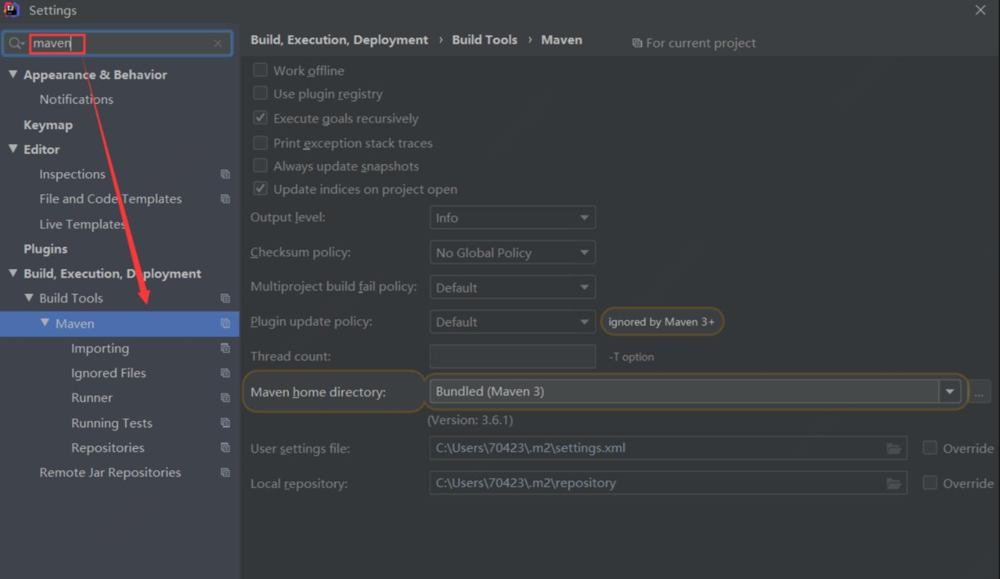
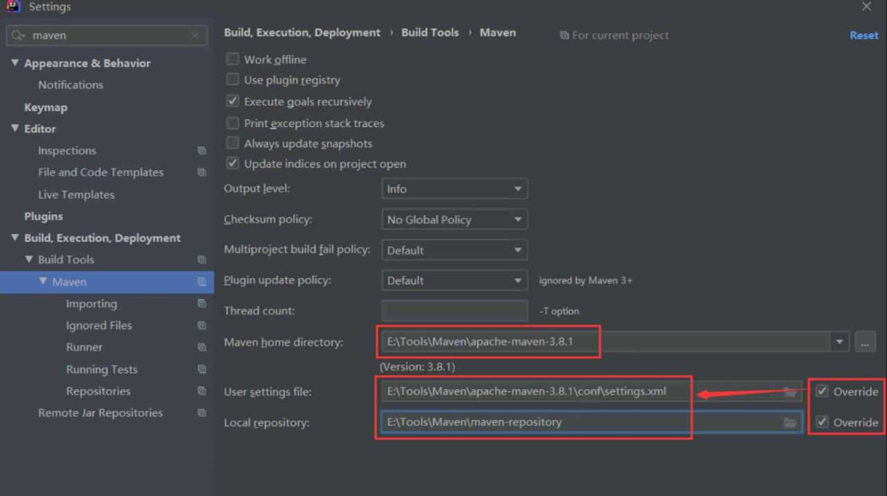
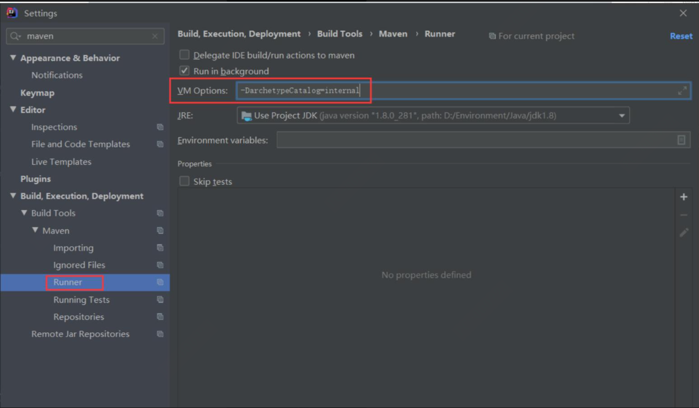
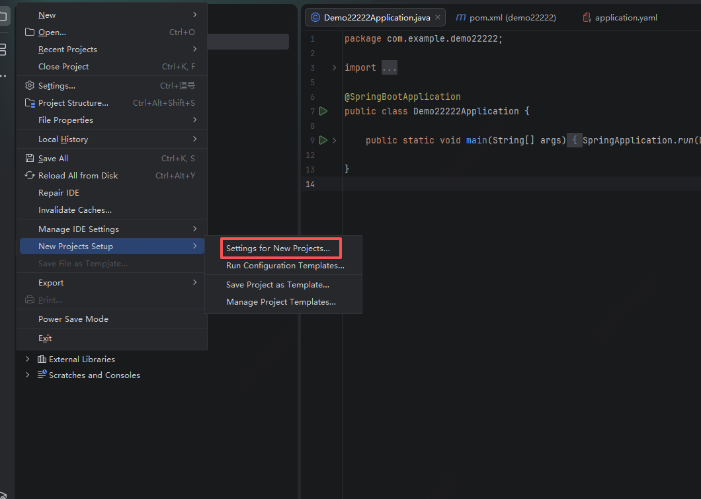
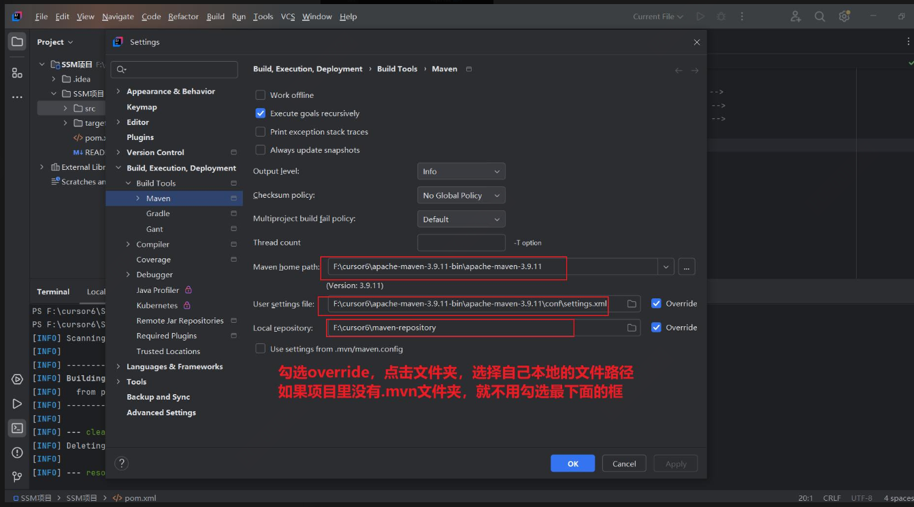

# Maven 安装与 IDEA 配置教程

本文档介绍 Maven 的安装、配置以及在 IntelliJ IDEA 中的使用。

---

## 一、Maven 安装（可选，也可用 IDEA 自带）

### 1.1 下载 Maven

推荐版本：**3.8.x / 3.9.x**（稳定兼容 JDK8）

- 官网下载：[https://maven.apache.org/download.cgi](https://maven.apache.org/download.cgi)
- 下载文件：`Binary zip archive`（如 `apache-maven-3.9.6-bin.zip`）

### 1.2 解压到指定目录

解压到**无中文、无空格**的路径：

```
D:\dev\apache-maven-3.9.6
```

### 1.3 修改 `conf/settings.xml`

打开 `D:\dev\apache-maven-3.9.6\conf\settings.xml`，进行以下配置：

#### （1）设置本地仓库（改到 D 盘，不占 C 盘）

在 `<settings>` 标签下添加：

```xml
<localRepository>D:\dev\maven_repo</localRepository>
```

#### （2）添加阿里云镜像（下载飞一般快）

找到 `<mirrors>` 标签，替换成：

```xml
<mirrors>
    <mirror>
        <id>aliyunmaven</id>
        <mirrorOf>central</mirrorOf>
        <url>https://maven.aliyun.com/repository/public</url>
    </mirror>
</mirrors>
```

#### （3）指定 JDK8 编译（适配你的 JDK8）

找到 `<profiles>`，加入：

```xml
<profile>
    <id>jdk-1.8</id>
    <activation>
        <activeByDefault>true</activeByDefault>
        <jdk>1.8</jdk>
    </activation>
    <properties>
        <maven.compiler.source>1.8</maven.compiler.source>
        <maven.compiler.target>1.8</maven.compiler.target>
        <maven.compiler.compilerVersion>1.8</maven.compiler.compilerVersion>
    </properties>
</profile>
```

---

## 二、IDEA 配置 Maven（全局 + 当前项目）

### 2.1 打开设置

- 快捷键：`Ctrl + Alt + S`
- 菜单：`File → Settings`

### 2.2 找到 Maven 配置

搜索框输入：`Maven`

进入：`Build, Execution, Deployment → Build Tools → Maven`



### 2.3 配置 3 个核心项（必须勾选 Override）

#### Maven home path

选择你解压的目录：

```
D:\dev\apache-maven-3.9.6
```

> 不想自己装就选：`Bundled (Maven 3)`

#### User settings file

勾选 `Override`，选择：

```
D:\dev\apache-maven-3.9.6\conf\settings.xml
```

#### Local repository

会自动读取 `settings.xml` 中的 `D:\dev\maven_repo`

如果没自动读取，就手动选择。



### 2.4 Runner 配置（解决中文乱码、加速）【若无必须的要求，可以不配置， 防止报错】

进入 `Maven → Runner`，在 `VM Options` 填入：

```
-DarchetypeCatalog=internal
```



### 5. 点击 `Apply → OK`

---

## 三、全局配置（新项目自动生效，必做！）

> 不做此步骤，每次新建项目又变回默认。

`File → New Projects Setup → Settings for New Projects`

重复上面 **步骤 2.2 ~ 2.4**（Maven 配置 + Runner）



点击 `Apply → OK`

---

## 四、验证配置是否成功

### 4.1 打开右侧 Maven 面板

- 点右侧边栏 `Maven`
- 或菜单：`View → Tool Windows → Maven`



### 4.2 刷新依赖

点击刷新图标（`Reload All Maven Projects`）

看到 `Dependencies` 正常加载、不爆红 = **成功**

### 4.3 命令行测试（可选）

打开 Terminal：

```bash
mvn -v
mvn help:system
```

能输出版本、本地仓库生成文件 = **完全正常**

---

## 五、常见问题

| 问题                 | 解决方案                                                          |
| -------------------- | ----------------------------------------------------------------- |
| C 盘爆满             | 按上面把 `localRepository` 改到 D 盘                              |
| 下载 jar 巨慢        | 必须配 **阿里云镜像**（上面已给）                                 |
| 新建项目又变回默认   | 必须做 **全局配置**（Settings for New Projects）                  |
| 编译报错：版本不兼容 | Runner 加 `-DarchetypeCatalog=internal`<br>settings.xml 固定 JDK8 |
| IDEA 不识别 Maven    | 检查路径无中文、无空格<br>重启 IDEA                               |

---

## 六、检查清单

- [ ] JDK8 已安装
- [ ] Maven + 阿里云镜像已配置
- [ ] 本地仓库在 D 盘
- [ ] IDEA 全局配置完成

✅ **配置完成！可以直接开始写 SpringBoot / 后端项目了！**
