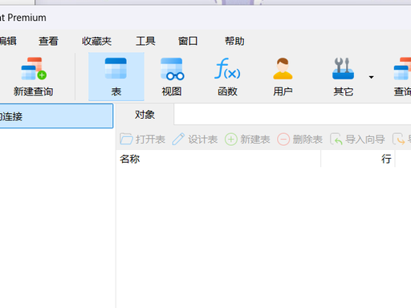
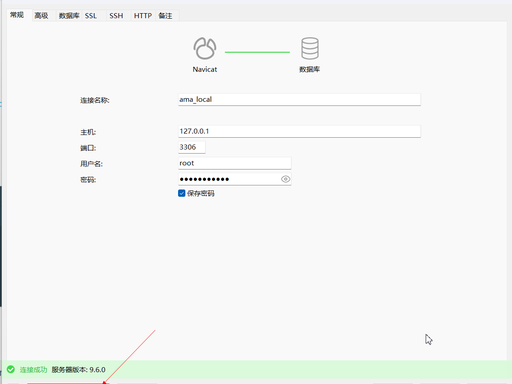
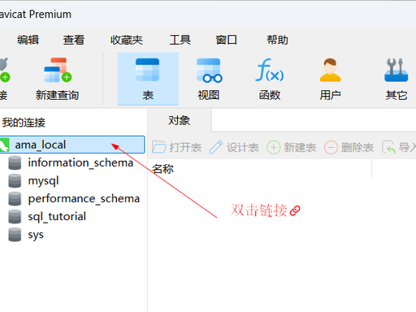

# MySql的安装与配置

## Windows 系统安装（最简单）

### 1. 下载安装包

官网地址：<https://dev.mysql.com/downloads/mysql/>

选择：

- Operating System：Microsoft Windows
- 下载：**MySQL Installer for Windows**（msi 格式，一键安装）

  不用注册，点 No thanks, just start my download 直接下。

### 2. 安装步骤

1. 双击运行安装包 → 同意协议 → Next
2. 选择安装类型：Developer Default（开发者默认，包含服务 + 客户端 + 工具）
3. 一路 Next → Execute 执行安装
4. 进入配置环节（关键）：

```
端口保持默认：3306
认证方式：选 Use Legacy Authentication Method（兼容 Navicat 等工具）
设置 root 密码：自己记好！（比如 123456）
可以创建一个普通用户（可选）
```

1. 一路 Next → Execute → Finish 完成

### 3. 验证安装成功

- 打开 MySQL 8.0 Command Line Client
- 输入你设置的 root 密码
- 出现 mysql> 说明安装成功！

### 4. 配置环境变量（可选，方便 CMD 直接用）

- 找到安装路径：默认 C:\Program Files\MySQL\MySQL Server 8.0\bin
- 把这个路径加到系统 Path 里
- 重启 CMD，输入 mysql -V 能看到版本就成功了

## Linux（CentOS 7 / Ubuntu）安装

### 1. CentOS 7 安装

```bash
# 1. 下载 MySQL 官方源
wget https://dev.mysql.com/get/mysql80-community-release-el7-3.noarch.rpm

# 2. 安装源
sudo rpm -ivh mysql80-community-release-el7-3.noarch.rpm

# 3. 安装 MySQL
sudo yum install -y mysql-community-server

# 4. 启动服务
sudo systemctl start mysqld
sudo systemctl enable mysqld

# 5. 查看初始密码
sudo grep 'temporary password' /var/log/mysqld.log
```

### 2. Ubuntu 安装

```bash
# 1. 更新源
sudo apt update

# 2. 安装
sudo apt install -y mysql-server

# 3. 启动
sudo systemctl start mysql
sudo systemctl enable mysql
```

### 3. Linux 初始化配置（必须做）

```bash
# 进入安全配置
sudo mysql_secure_installation
```

按提示：

- 输入初始密码
- 设置新密码
- 一路 Y 确认即可

### 4. 登录测试

```bash
mysql -u root -p
```

输入密码，进入 mysql> 即成功。

## 3. 安装后必做的基础设置

### 1. 允许远程连接（Navicat/DBeaver 连接）

```sql
-- 登录MySQL后执行
USE mysql;
ALTER USER 'root'@'localhost' IDENTIFIED WITH mysql_native_password BY '你的密码';
CREATE USER 'root'@'%' IDENTIFIED BY '你的密码';
GRANT ALL PRIVILEGES ON *.* TO 'root'@'%' WITH GRANT OPTION;
FLUSH PRIVILEGES;
```

### 2. 防火墙开放 3306 端口

- Windows：关闭防火墙 或 允许 3306 通过
- Linux：

```bash
sudo firewall-cmd --add-port=3306/tcp --permanent
sudo firewall-cmd --reload
```

## 4. 常见问题

### 1. Navicat 连接报错 1251

- 原因：密码加密方式不兼容
- 解决：执行上面「允许远程连接」的 SQL 即可

### 2. Windows 服务启动失败

- 卸载 → 清理残留目录 → 重新安装，不要改安装路径

### 3. Linux 登录报错 Access denied

- 用 sudo mysql 免密登录，再重置密码

## 5. Mysql 本地操作软件 Navicat 安装配置

### 1. 下载 Navicat

- 中文网地址： <https://www.navicat.com.cn/zh-cn/download/>

- 下载免费版：<https://www.navicat.com.cn/download/navicat-premium-lite.html>

### 2. 安装步骤（Windows，以管理员身份运行）

- 双击安装包 → 【下一步】
- 勾选 **我接受许可协议** → 【下一步】
- **安装路径建议选非 C 盘**（如 D:\Navicat 17）→ 【下一步】
- 快捷方式默认即可 → 【下一步】
- 开始安装 → 等待 2 分钟
- 安装完成，**先不要打开** → 【完成】

### 3. 激活 / 登录

- 打开 Navicat → 选择 **登录 Navicat ID**
- 用邮箱注册一个账号，邮箱收验证码激活 → 登录即可**永久免费使用**（功能足够开发）

### 4. 配置：连接本地 MySQL（最常用）

---

#### 1. 打开 Navicat → 左上角 连接 → MySQL



#### 2. 填写连接信息（**本地 MySQL 默认**）

- 连接名：LocalMySQL（随便写）
- 主机：localhost 或 127.0.0.1
- 端口：3306（MySQL 默认）
- 用户名：root
- 密码：你安装 MySQL 时设置的 root 密码



#### 3. 点 **测试连接** → 提示 **连接成功** → 【确定】保存



#### 4. 双击左侧 LocalMySQL → 展开数据库，即可操作

### 5. Navicat 常见问题

---

#### 1. 连接失败：10061 无法连接

- MySQL 服务没启动：Win+R → services.msc → 找到 MySQL → 启动
- 端口不是 3306：去 MySQL 配置文件 my.ini 确认端口

#### 2. 连接失败：1045 密码错误

- 核对 root 密码；忘记密码需重置 MySQL root 密码

#### 3. 中文乱码

- 连接设置 → 高级 → 编码选 utf8mb4 → 重连
