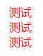
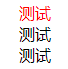
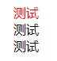
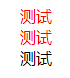
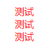
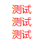
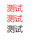
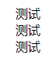
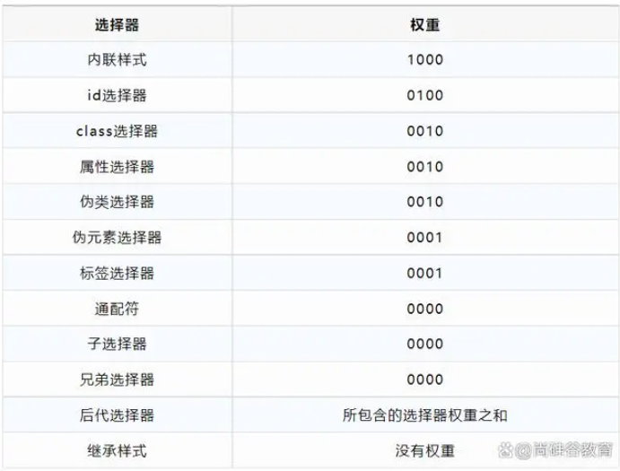
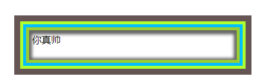

<!--
 * @Date: 2023-11-02 14:03:30
 * @LastEditors: zhumanyao
 * @LastEditTime: 2023-11-03 17:00:19
 * @FilePath: \ocean-of-knowledge\docs\front-end-architects\interview\base\css\index.md
-->

# css3 有哪些新特性

## 1. css3 选择器

- 基础选择器

| 选择器             | 语法      | 描述                                                  |
| ------------------ | --------- | ----------------------------------------------------- |
| 标签选择器         | 标签名    | 标签自身                                              |
| 类选择器           | .class 名 | 给标签添加 class 属性                                 |
| id 选择器          | #id 名    | 给标签添加 id 属性                                    |
| 后代（包含）选择器 | div p     | div 和 p 中间用空格隔开                               |
| 子代选择器         | div > p   | 用来选择紧挨着 div（父元素）的第一层符合 p 的子元素   |
| 全部兄弟选择器     | div~p     | 选择当前元素所有符合条件的兄弟元素。                  |
| 相邻兄弟选择器     | div+p     | 选中当前元素紧挨着的后面的兄弟元素                    |
| 并集（群组）选择器 | div, p    | 用于对多个标签定义同样的样式，选择器之间用逗号分隔    |
| 交集选择器         | div.title | 用于选择同时符合选择器 div 和选择器 .title 条件的元素 |

- 属性选择器

```html
<div class="name name1-title" id="name">测试</div>
<div class="name1 name">测试</div>
<div class="tame">测试</div>

<!-- 最后一个限值条件 只有在属性只有唯一值才能生效 -->
<style>
  div[class|='name1'] {
    color: red;
  }
</style>
```

| 选择器         | 语法                    | 描述                                                                                             |
| -------------- | ----------------------- | ------------------------------------------------------------------------------------------------ |
| 属性的或运算   | div[class]              | 只要选择器元素中有当前属性就会被选中                                       |
| 属性的与运算   | div[class][id]          | 选择同时包含属性 1 和属性 2 的元素                                       |
| 属性值的筛选   | div[class='name']       | 选择对应的属性值符合要求的元素(属性只有唯一值才能生效)                   |
| 前缀筛选^      | div[class^='nam']       | 选择属性值以当前要求开头的元素                                           |
| 后缀筛选$      | div[class$="me"]        | 选择属性值以当前要求结尾的元素                                           |
| 包含限定\*     | div[class*="ame"]       | 选择属性值包含当前要求的元素                                             |
| 包含限定~      | div[class~='name']      | 选择属性值包含一个给定要求词（单独存在）的元素                           |
| 包含限定(竖线) | div[class 竖线='name1'] | 选择属性值只有给定要求或者是以给定要求开头后面用“-”拼接其他字符串的元素  |

- 伪类选择器

```html
<!-- 动态伪类选择器 -->
<div class="name" id="name">测试</div>
<div class="name">测试</div>
<a class="name" href="https://baidu.com">测试</a>
<a class="name" href="https://zhumanyao.com">测试</a>

<!-- 结构伪类选择器 -->
<div class="name">
  <div class="name1">你好</div>
  <div class="name1">你好</div>
  <p class="name1">你好</p>
  <h1 class="name1">你好</h1>
  <h3 class="name1">你好</h3>
  <a class="name1">你好</a>
</div>
```

| 选择器               | 语法                                    | 描述                                                                                                                                |
| -------------------- | --------------------------------------- | ----------------------------------------------------------------------------------------------------------------------------------- |
| 动态伪类选择器       |                                         |                                                                                                                                     |
|                      | a:link                                  | 只能用於超鏈接，用来定义未访问的链接样式                                                                                            |
|                      | a:visited                               | 只能用於超鏈接，用来定义已访问的链接样式                                                                                            |
|                      | a:hover                                 | 定义鼠标滑过（悬停）时的样式                                                                                                        |
|                      | a:active                                | 定义鼠标按下时的样式                                                                                                                |
|                      | input:focus                             | 用于选择获得焦点的表单的元素样式                                                                                                    |
| 结构伪类选择器       |                                         |                                                                                                                                     |
|                      | .name:first-child / .name:last-child    | 选择属于父元素的首个/最后一个子元素的每个 element 元素，注意 element 为子元素                                                       |
|                      | .name:nth-child(n)                      | 选择某元素下的第 n 个 element 元素（n 是一个简单的表达式，不能用其他的字母代替），括号里还可以传 odd(奇数)和 even（偶数）两个关键字 |
|                      | .name:nth-last-child(n)                 | 匹配属于某元素下的第 n 个 element 子元素，从最后一个子元素开始数                                                                    |
|                      | .name:nth-of-type(n)                    | 匹配属于父元素的特定类型的第 n 个子元素,element 为指定类型的子元素                                                                  |
|                      | .name:nth-last-of-type(n)               | 匹配属于父元素的特定类型的第 n 个子元素，从最后一个计数                                                                             |
|                      | .name:first-of-type/ .name:last-of-type | 匹配属于其父元素的特定类型的首个/最后一个子元素的每个元素                                                                           |
|                      | .name:only-child                        | 匹配属于父元素的唯一子元素的每个元素                                                                                                |
|                      | .name:only-of-type                      | 匹配属于其父元素特定类型的唯一子元素的每个元素                                                                                      |
|                      | .name:empty                             | 匹配没有子元素（包括文本节点）的每个元素                                                                                            |
|                      | .name:not(.name1)                       | 定义：匹配非 元素或者选择器 的每个元素                                                                                              |
| 其他伪类选择器       |                                         |                                                                                                                                     |
| 目标伪类选择器       | p:target                                | 匹配被相关 url 指向的 p 元素 （当我们点击锚点链接时，对应 id 的元素会显示在视口[样式]）                                             |
| 语言伪类选择器       | p:lang(language)                        | 匹配指定语言的元素                                                                                                                  |
| 选中状态伪类选择器   | input:checked                           | 匹配 form 表单中处于选中状态的元素                                                                                                  |
| 可用状态伪类选择器   | input:enabled                           | 匹配 form 表单中处于可用状态的元素                                                                                                  |
| 不可用状态伪类选择器 | input:disabled                          | 匹配 form 表单中处于不可用状态的元素                                                                                                |

- 伪元素选择器

| 选择器 | 语法                  | 描述                                              |
| ------ | --------------------- | ------------------------------------------------- |
|        | element::before       | 在元素的内容前面插入新内容，常与 content 配合使用 |
|        | element::after        | 在元素的内容后面插入新内容，常与 content 配合使用 |
|        | element::first-letter | 用于向文本的首字母设置特殊样式，只能用于块级元素  |
|        | element::first-line   | 对元素的第一行文本进行设置，只能用于块级元素      |
|        | element::selection    | 用于设置浏览器中选中文本后的背景色与前景色        |

- 选择器权重



- 伪元素与元素的区别:

```js
无法通过JS获取其DOM

无法通过浏览器开发者工具直接查看

伪元素默认是 inline
```

- 使用伪元素注意事项

```js
使用伪元素before,after必须设置content

使用伪元素before,after显示背景图，一定要使用display设置为块元素

使用伪元素before,after设置为display:inline-block,需要再次设置vertical-align:middle
```

## 2. 边框特性

- 圆角 border-radius

```css
div {
  border-radius: 4px; // 圆角
  border-top-right-radius: 4px; // 右上角
  border-bottom-left-radius: 4px; // 左下角
}
```

- 盒阴影 box-shadow (实现多层边框)

```css
div {
  // 语法
  // box-shadow: 水平方向的偏移量 垂直方向的偏移量 模糊程度 扩展程度 颜色 是否具有内阴影;
  width: 400px;
  height: 100px;
  box-shadow: 0 0 0 10px #655 inset, 0 0 0 15px greenyellow inset, 0 0 0 20px deepskyblue inset, 0 0
      0 25px yellowgreen inset, 0 2px 5px 30px rgba(0, 0, 0, 0.6) inset;
  padding: 30px;
}
```



- 边框颜色

```css
div {
  border: 4px solid;
  border-color: red green blue black;
}
```

## 3. 多重背景图

- 多重背景
