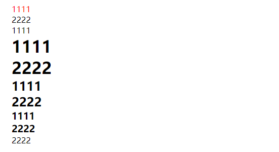
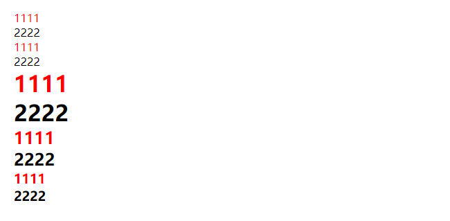

# nth-child 与 nth-of-type 的区别

## first-child 与 first-of-type 的区别

- first-child : 选择属于父元素下面的第一个子元素

```html
<ul>
  <div class="name">1111</div>
  <div class="name">2222</div>
  <p class="name">1111</p>
  <h1 class="name">1111</h1>
  <h1 class="name">2222</h1>
  <h2 class="name">1111</h2>
  <h2 class="name">2222</h2>
  <h3 class="name">1111</h3>
  <h3 class="name">2222</h3>
  <p class="name">2222</p>
</ul>

<style>
  .name:first-child {
    color: red;
  }
  /* 就等于 */
  .name:nth-child(1) {
    color: red;
  }
  /* 就等于 */
  div:nth-child(1) {
    color: red;
  }

  /* 注意: 这个样式是无效的， 应为在上面这个结构中， 父元素的第一个子元素不是p*/
  p:nth-child(1) {
    color: red;
  }
</style>
```



- first-of-type : 选择属于父元素下的各种特定类型(各种类型元素)的第一个子元素

```html
<ul>
  <div class="name">1111</div>
  <div class="name">2222</div>
  <p class="name">1111</p>
  <p class="name">2222</p>
  <h1 class="name">1111</h1>
  <h1 class="name">2222</h1>
  <h2 class="name">1111</h2>
  <h2 class="name">2222</h2>
  <h3 class="name">1111</h3>
  <h3 class="name">2222</h3>
</ul>

  <style>
    .name:first-of-type {
      color: red;
    }
    /* 就等于 */
    .name:nth-of-type(1) {
      color: red;
    }
  </style>
</ul>
```



## nth-child 与 nth-of-type 的区别

- nth-child(n) : 选择属于父元素下的第 N 个子元素

- nth-of-type(n) : 选择属于父元素下的各种特定类型（各种类型元素）的第 N 个子元素
