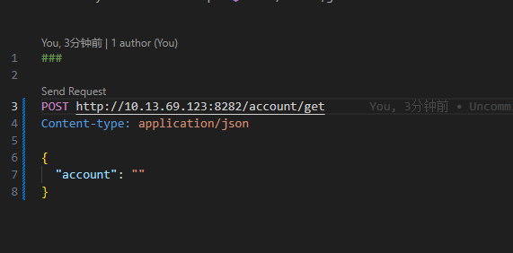

<!--
 * @Date: 2023-12-26 19:20:17
 * @LastEditors: zhumanyao
 * @LastEditTime: 2023-12-26 19:25:22
 * @FilePath: \ocean-of-knowledge\docs\front-end-architects\util\vscode.md
-->

# vsCode 常用插件

## REST Client （请求接口）

- 编辑器中使用所选文本发送请求 (直接在编辑器中请求接口的插件)
  
