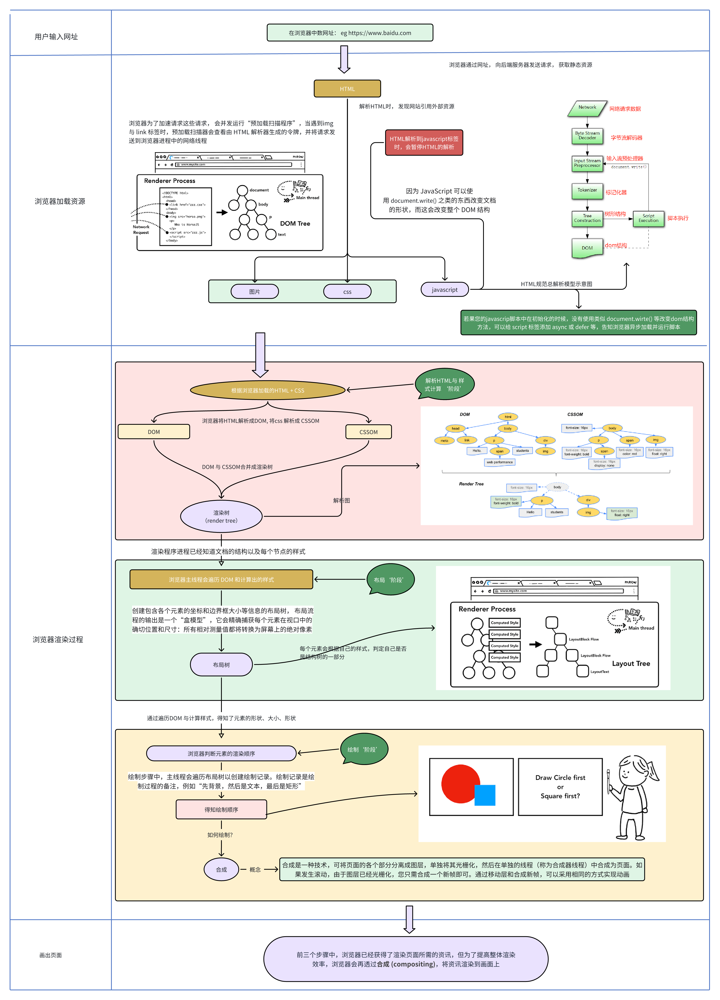
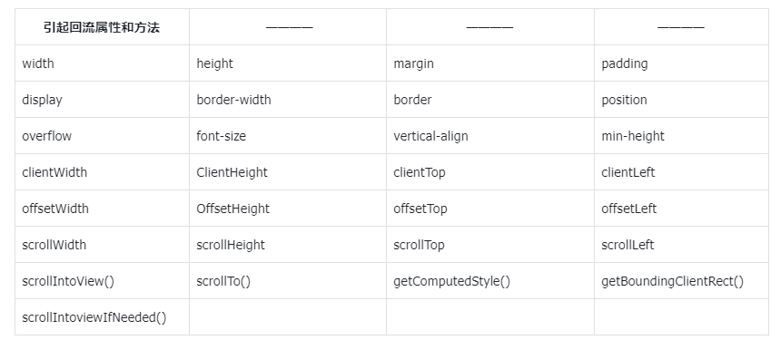
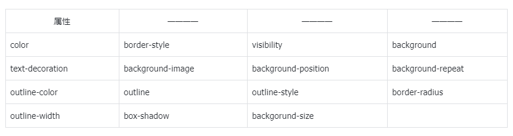

<!--
 * @Author: zhumanyao zhumanyao@sungrowpower.com
 * @Date: 2024-04-17 13:32:16
 * @LastEditors: zhumanyao zhumanyao@sungrowpower.com
 * @LastEditTime: 2024-04-17 13:44:08
 * @FilePath: \ocean-of-knowledge\docs\knowledge-module\base\browser\index.md
 * @Description: 这是默认设置,请设置`customMade`, 打开koroFileHeader查看配置 进行设置: https://github.com/OBKoro1/koro1FileHeader/wiki/%E9%85%8D%E7%BD%AE
-->
# 浏览器渲染过程 + 网站性能优化

## 浏览器渲染页面的过程

## 2. 浏览器的 ‘重绘’ 与 ‘回流’

### 2.1 重绘 与 回流 是什么？

- 重绘 与 回流 指的就是渲染的布局 (layout) 和绘制 (paint) 的步骤。当我们做了某些事情改变布局或样式，就会触发回流 (Reflow) 或重绘 (Repaint)。

- 要注意的是，浏览器的渲染过程其实是有代价的，因为在渲染过程中，每个步骤都会使用上一个操作的结果来创建新数据。例如：如果布局树 (layout Tree) 改变，那就会需要重新绘制。所以如果能够尽量避免回流 (Reflow) 或重绘 (Repaint)，就能够大大提升效能。

- 回流：当渲染树render tree中的一部分(或全部)因为元素的规模尺寸，布局，隐藏等改变而需要重新构建。这就称为回流(reflow)。

简单来说，回流就是计算元素在设备内的确切位置和大小并且重新绘制。

回流的代价要远大于重绘。并且回流必然会造成重绘，但重绘不一定会造成回流。

- 重绘：当渲染树render tree中的一些元素需要更新样式，但这些样式属性只是改变元素的外观，风格，而不会影响布局的，比如background-color。则就叫称为重绘(repaint)。

简单来说，重绘就是将渲染树节点转换为屏幕上的实际像素，不涉及重新布局阶段的位置与大小计算

### 2.2 何时触发重绘， 触发重绘的条件？

###### 2.2.1 回流 ： 触发条件

- 页面首次渲染 （无法避免且开销最大的一次）
- 浏览器窗口大小发生改变（resize事件）
- 元素尺寸或位置发生改变（边距、宽高、边框等）
- 元素内容变化（文字数量或图片大小等等）
- 元素字体大小变化（font-size）
- 添加或者删除可见的DOM元素
- 激活CSS伪类（例如：:hover）
- 查询某些属性或调用某些方法

###### 2.2.2 重绘： 触发条件

- 修改重绘的属性

## 3. 减少重绘与回流的性能优化

- 用 transform 做形变和位移可以减少回流
- 避免逐个修改节点样式，尽量一次性修改
- 可以将需要多次修改的 DOM 元素设置 display：none ，操作完再显示（因为隐藏元素不在 render 树内，因此修改隐藏元素不会触发回流重绘）
- 避免多次读取某些属性
- 通过绝对位移将复杂的节点元素脱离文档流，形成新的 Render Layer,降低回流成本

[其他优化方案](https://h2xiovzyde.feishu.cn/wiki/UXjjwQqssiSSZik2kdtcWlRvnOb?fromScene=spaceOverview)

## 4. 网站性能优化

通过浏览器的渲染过程， 可以得知网站性能优化方案：

- 4.1.1 减少不必要的http请求， 可以合并图片（精灵图）、合并css/js文件
- 4.1.2 针对在初始化时，不时不必须的图片，css/js文件，可以采用懒加载或按需加载的方式实现
- 4.1.3 压缩css/js文件，减少其体积
- 4.1.4 针对javascript文件，可以根据其需要设置 async/defer 实现其异步加载并执行
- 4.1.5 针对静态文件，可以对其进行版本控制，采用缓存
- 4.1.6 编辑代码的时候，注意css 与 js的编译，笔辩不必要的重绘与回流
- 4.1.7 使用CDN: CDN（内容分发网络）可以将网站的静态资源分发到全球各地的服务器上，减少资源加载时间，提高网站访问速度