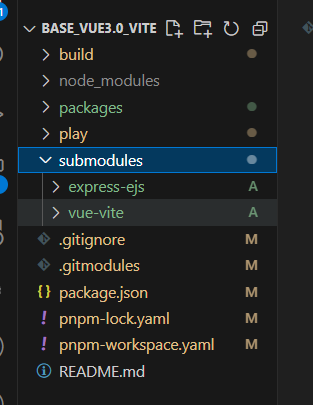

<!--
 * @Date: 2023-10-18 18:15:57
 * @LastEditors: Please set LastEditors
 * @LastEditTime: 2025-01-06 14:53:08
 * @FilePath: \ocean-of-knowledge\docs\knowledge-module\node\git\gitmodules.md
-->

# git 子模块指令 与 .gitmodules 文件的作用

## git 子模块指令

```js
- 添加项目
// url: git仓库地址  newName: 在项目重的新地址
git submodule add <url> <newName>

- 拉取他人项目
git submodule init
git submodule update

- deinit 移除已有的 submodule
git submodule deinit <submodule name>
```

## git 创建子模块，且指定拉取代码发分支

```js
git submodule add -b <origin-branch-name> <url> <newName>
```

## 在项目中使用子模块的流程

- 添加子模块 <执行命令>

```js
// git submodule add <url> <newName>

git submodule add https://gitee.com/stylepicasso/express_ejs.git submodules/express-ejs
```

- .gitmodules 文件填写的内容 —— 上面指令可以生成以下代码  —— 指定远程分支

```js
[submodule 'submodules/express-ejs']
  path = submodules/express-ejs   // 自动生成
  url = https://gitee.com/stylepicasso/express_ejs.git  // 自动生成
  branch = main   // 手动添加  —— 指定从远程哪个分支拉去代码
```



- 初始化子模块

添加子模块后，您需要初始化子模块：

```js
git submodule init
```

这将为每个子模块在仓库中初始化一个特殊的文件。这时，子模块处于“未初始化”状态。

- 更新子模块

此命令将每个子模块切换到其最新的提交。

```js
git submodule update
```

- 提交子模块的更改

```js
cd <submodule>
git checkout -b dev  // 创建一个开发分支， 若拉取代码就创建， 此处就不用创建了
git add .
git commit -m 'fix：修改分支'
git push origin dev
```

- 合并提交的子模块分支

到 git 仓库将提交的子模块发开分支代码提交到 master 分支上， 这样就可以了

- 拉取子模块的更改

```js
cd <submodule>
git pull origin master
```

也可以执行

```js
git submodule update
```

- 最后： 主项目仓库需要执行更新命令， 更新最新的内容和 commit id

```
git submodule update --remote
```

- 再将主项目进行提交

```js
git add .
git commit -m 'fi: xiugai'
git push origin master
```

## 具体操作案例步骤

- 以 server-web (主项目)； express-server、fastify-server、nestjs-server (子项目【子模块】) 为例

#### 步骤 1 创建代码仓库

分别创建这 4 个仓库

#### 步骤 2 拉取主项目代码

```js
git clone https://gitee.com/nest-js/server-web.git
```

#### 步骤 3 主项目开发

主项目开发，与正常项目开发流程一致

#### 步骤 4 拉取子模块（子仓库）代码

```js
git submodule add https://gitee.com/nest-js/nestjs-server.git node-server/nextjs-server

git submodule add https://gitee.com/nest-js/express-server.git node-server/express-server

git submodule add https://gitee.com/nest-js/fastify-server.git node-server/fastify-server
```

#### 步骤 5 初始化 与 更新子模块

```js
git submodule init
git submodule update
```

#### 步骤 6 子模块代码开发

切入到子模块目录， 切换分支为开发分支 dev（提交后合并到 master）或直接切到 master，正常开发子模块代码即可

#### 步骤 7 子模块代码提交

切到子模块代码目录下，按照正常流程提交

```js
// nestjs-server
git add .
git commit -m 'feat: nestjs后端服务开发'
git push origin master

// express-server 与 fastify-server 操作遇上一致
```

#### 步骤 8 更新子模块的提交

主项目需要更新子项目最新提交的内容 与 commit id

```js
git submodule update --remote
```

#### 步骤 9 主项目代码提交

主项目代码提交， 按正常项目提交流程提交即可

#### 最后： 再次拉取代码操作

经过以上操作， 若是有新同事拉取 server-web 代码， 想要再次获取子模块的代码， 只需要初始化与更新子模块即可

```js
git submodule init
git submodule update
```

#### 注意

若是后面的同事，在拉取主项目代码 以及 子模块代码之后， 主项目与子模块的代码都需要修改， 你们修改与提交操作如上
