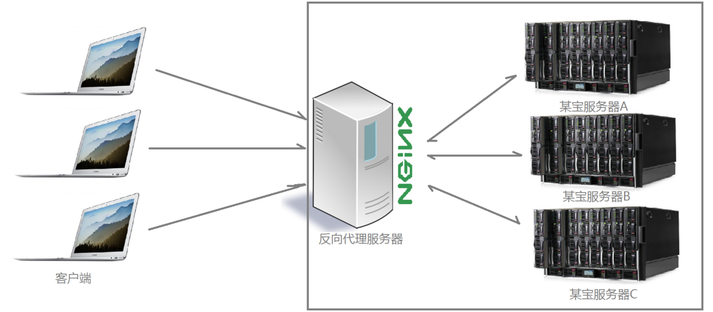
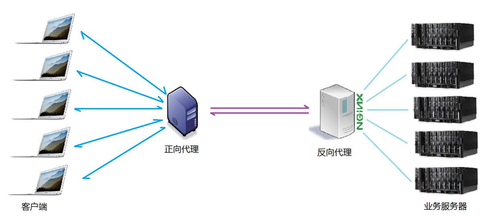
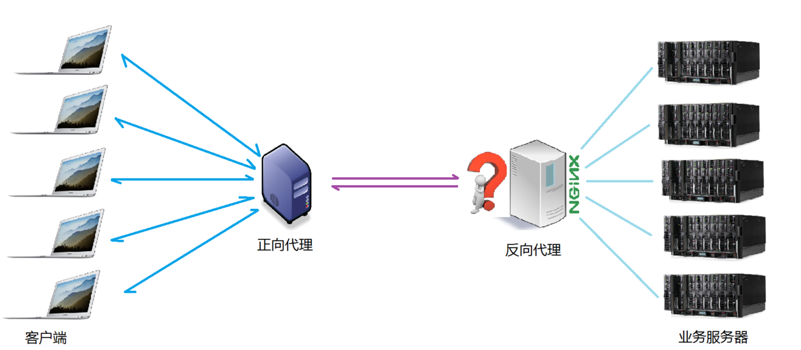
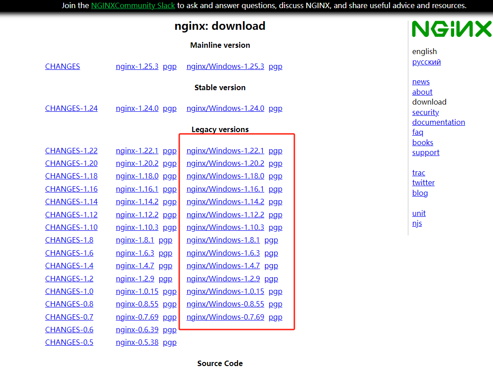
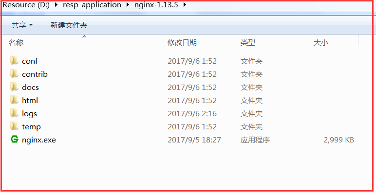
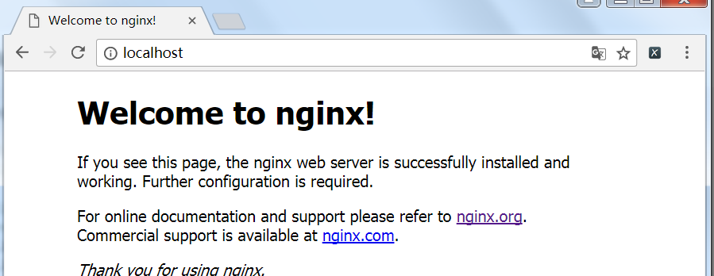
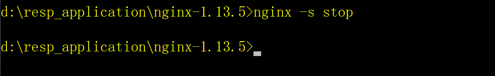

<!--
 * @Date: 2023-12-05 19:28:51
 * @LastEditors: zhumanyao
 * @LastEditTime: 2023-12-07 17:23:23
 * @FilePath: \ocean-of-knowledge\docs\knowledge-module\node\nginx\index.md
-->

# Nginx 的概念、安装与配置

## nginx 概念

nginx 是一款自由的、开源的、高性能的 HTTP 服务器和反向代理服务器；同时也是一个 IMAP、POP3、SMTP 代理服务器；nginx 可以作为一个 HTTP 服务器进行网站的发布处理，另外 nginx 可以作为反向代理进行负载均衡的实现。

这里主要通过三个方面简单介绍 nginx

- 反向代理
- 负载均衡
- nginx 特点

## 1、反向代理

- 关于代理

说到代理，首先我们要明确一个概念，所谓代理就是一个代表、一个渠道；

此时就设计到两个角色，一个是被代理角色，一个是目标角色，被代理角色通过这个代理访问目标角色完成一些任务的过程称为代理操作过程；如同生活中的专卖店~客人到 adidas 专卖店买了一双鞋，这个专卖店就是代理，被代理角色就是 adidas 厂家，目标角色就是用户。


- 正向代理

说反向代理之前，我们先看看正向代理，正向代理也是大家最常接触的到的代理模式，我们会从两个方面来说关于正向代理的处理模式，分别从软件方面和生活方面来解释一下什么叫正向代理。

在如今的网络环境下，我们如果由于技术需要要去访问国外的某些网站，此时你会发现位于国外的某网站我们通过浏览器是没有办法访问的，此时大家可能都会用一个操作 FQ 进行访问，FQ 的方式主要是找到一个可以访问国外网站的代理服务器，我们将请求发送给代理服务器，代理服务器去访问国外的网站，然后将访问到的数据传递给我们！

上述这样的代理模式称为正向代理，正向代理最大的特点是客户端非常明确要访问的服务器地址；服务器只清楚请求来自哪个代理服务器，而不清楚来自哪个具体的客户端；**正向代理模式屏蔽或者隐藏了真实客户端信息**。


- 反向代理

明白了什么是正向代理，我们继续看关于反向代理的处理方式，举例如我大天朝的某宝网站，每天同时连接到网站的访问人数已经爆表，单个服务器远远不能满足人民日益增长的购买欲望了，此时就出现了一个大家耳熟能详的名词：分布式部署；也就是通过部署多台服务器来解决访问人数限制的问题。

那么反向代理具体是通过什么样的方式实现的分布式的集群操作呢，我们先看一个示意图：



通过上述的图解大家就可以看清楚了，多个客户端给服务器发送的请求，nginx 服务器接收到之后，按照一定的规则分发给了后端的业务处理服务器进行处理了。此时请求的来源也就是客户端是明确的，但是请求具体由哪台服务器处理的并不明确了，nginx 扮演的就是一个反向代理角色

**反向代理，主要用于服务器集群分布式部署的情况下，反向代理隐藏了服务器的信息！**

- 项目场景

通常情况下，我们在实际项目操作时，正向代理和反向代理很有可能会存在在一个应用场景中，正向代理代理客户端的请求去访问目标服务器，目标服务器是一个反向单利服务器，反向代理了多台真实的业务处理服务器。具体的拓扑图如下：



## 2、负载均衡

我们已经明确了所谓代理服务器的概念，那么接下来，nginx 扮演了反向代理服务器的角色，它是以依据什么样的规则进行请求分发的呢？不用的项目应用场景，分发的规则是否可以控制呢？

- 这里提到的客户端发送的、nginx 反向代理服务器接收到的请求数量，就是我们说的负载。
- 请求数量按照一定的规则进行分发到不同的服务器处理的规则，就是一种均衡规则。
- 所以将服务器接收到的请求按照规则分发的过程，称为负载均衡。

负载均衡在实际项目操作过程中，有硬件负载均衡和软件负载均衡两种，硬件负载均衡也称为硬负载，如 F5 负载均衡，相对造价昂贵成本较高，但是数据的稳定性安全性等等有非常好的保障，如中国移动中国联通这样的公司才会选择硬负载进行操作；更多的公司考虑到成本原因，会选择使用软件负载均衡，软件负载均衡是利用现有的技术结合主机硬件实现的一种消息队列分发机制。



nginx 支持的负载均衡调度算法方式如下：

1. weight 轮询（默认）：接收到的请求按照顺序逐一分配到不同的后端服务器，即使在使用过程中，某一台后端服务器宕机，nginx 会自动将该服务器剔除出队列，请求受理情况不会受到任何影响。 这种方式下，可以给不同的后端服务器设置一个权重值（weight），用于调整不同的服务器上请求的分配率；权重数据越大，被分配到请求的几率越大；该权重值，主要是针对实际工作环境中不同的后端服务器硬件配置进行调整的。

2. ip_hash：每个请求按照发起客户端的 ip 的 hash 结果进行匹配，这样的算法下一个固定 ip 地址的客户端总会访问到同一个后端服务器，这也在一定程度上解决了集群部署环境下 session 共享的问题。

3. fair：智能调整调度算法，动态的根据后端服务器的请求处理到响应的时间进行均衡分配，响应时间短处理效率高的服务器分配到请求的概率高，响应时间长处理效率低的服务器分配到的请求少；结合了前两者的优点的一种调度算法。但是需要注意的是 nginx 默认不支持 fair 算法，如果要使用这种调度算法，请安装 upstream_fair 模块

4. url_hash：按照访问的 url 的 hash 结果分配请求，每个请求的 url 会指向后端固定的某个服务器，可以在 nginx 作为静态服务器的情况下提高缓存效率。同样要注意 nginx 默认不支持这种调度算法，要使用的话需要安装 nginx 的 hash 软件包

## 3、nginx 特点

- 高性能：Nginx 使用事件驱动模型，可以同时处理大量的并发连接，而且在高负载和大流量情况下仍然能够保持良好的性能。
- 轻量级：Nginx 的代码量非常少，而且占用内存较少，所以它可以在资源受限的系统中运行，在高负载下也不容易崩溃。
- 可扩展性：Nginx 支持众多的第三方模块，可以根据需要进行自定义开发，实现更多的功能。
- 高度可靠性：Nginx 是基于稳定的、成熟的事件驱动架构开发的，能够有效的避免由于代码错误或者第三方库的问题而导致的崩溃，从而保证了服务的高可靠性。
- 热部署：Nginx 支持在不停止服务的情况下更新配置文件和软件升级，非常方便。
- 高度可定制化：Nginx 可以根据需要进行高度定制化，将不需要的模块和功能剔除掉，从而减少不必要的代码和资源浪费。

## Nginx 安装

- windows 安装

下载 nginx

官方网址下载地址：

[https://nginx.org/en/download.html](https://nginx.org/en/download.html)

如下图所示，下载对应的版本的 nginx 压缩包，解压到自己电脑上存放软件的文件夹中即可



解压完成后，文件目录结构如下：



##### 启动 nginx

1. 直接双击该目录下的 nginx.exe，即可启动 nginx 服务器
2. 命令行计入该文件夹，执行 nginx 命令，也会直接启动 nginx 服务器

```js
D:/resp_application/nginx-1.13.5> nginx
```


##### 访问 nginx

打开浏览器，输入地址：[http://localhost](http://localhost)，访问页面，出现如下页面表示访问成功



##### 停止 nginx

命令行进入 nginx 根目录，执行如下命令，停止服务器：

```js
# 强制停止nginx服务器，如果有未处理的数据，丢弃
D:/resp_application/nginx-1.13.5> nginx -s stop

# 优雅的停止nginx服务器，如果有未处理的数据，等待处理完成之后停止
D:/resp_application/nginx-1.13.5> nginx -s quit
```


