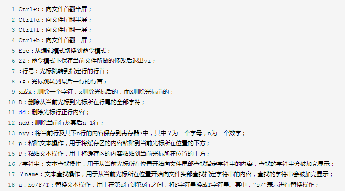
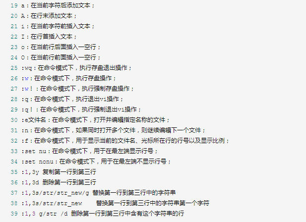
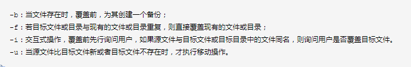
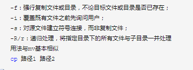
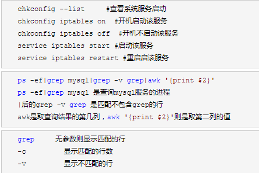
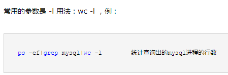
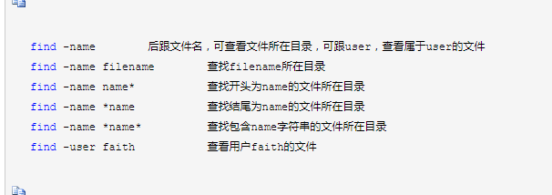

<!--
 * @Date: 2023-12-05 20:06:10
 * @LastEditors: zhumanyao
 * @LastEditTime: 2023-12-06 18:14:49
 * @FilePath: \ocean-of-knowledge\docs\knowledge-module\node\nginx\linux.md
-->

# Linux 系统指令

## 1.最常用的 cd 指令

```js
cd   // 进入用户主目录
cd ~   // 进入用户主目录
cd - // 返回进入此目录之前所在的目录
cd /   // 返回根目录
cd ..  // 返回上级目录 （若当前目录为“/“，则执行完后还在“/"；".."为上级目录的意思）
cd ../..   // 返回上两级目录
```

## 2.新建文件夹和文件 (mkdir/touch)

```js
mkdir <dirname>  // 创建文件夹
mkdir /opt/lamp/<dirname>  // 可跟路径创建文件夹
mkdir -p /opt/lamp/<dirname>  // 假如lamp文件夹不存在， 需要用 -p 可以创建该文件夹

touch <filename>  // 创建文件
```

## 3.文件查看 (cat/less/more/tail)

```js
// 最常用的是 cat
cat <
  filename > // 查看文件内容
  // 查看文件夹内的内容
  ls
```

## 4.查看文件大小 (du / df)

```js
du -sh *   // 显示当前目录下所有文件的大小
du -sh filename   // 显示该文件大小
du -sh    // 显示当前目录所占空间大小
-s  // 仅显示总计，只列出最后加总的值
-h  // 以 K/ M/ G为单位，提高信息的可读性

df // 显示磁盘	占用信息
直接用 df 默认以 k 为单位
df -lh  // 显示本地系统的占用信息，以K/M/G 为单位
```

## 5.文本编辑器 vi

- vi 命令是 linux 操作系统 和 类 linux 操作系统中最常用的全屏纯文本编辑器
- vi filename 打开编辑指令
- vi 编辑器支持编辑模式和指令模式；要注意两种模式的切换
- 默认情况下，打开 vi 编辑器后会自动进入命令模式。从编辑模式进入命令模式使用 ‘Esc’ 键；从命令模式切换到 编辑模式使用 ‘A’、‘a’、‘O’、‘o’、‘I’、‘i’ 键
  编辑器内部提供了丰富的指令：
  
  

## 6.移动文件及文件夹 (mv/cp)

- mv 类似于 windows 下的剪切

```js
mv aaa /etc/udev    // 讲aaa 移至 / etc/udev 目录下
mv /opt/lamp /etc/udev  // 将opt目录下的lamp移至 /etc/udev 目录下
mv -r aaa /etc/udev    // 将aaa文件夹递归移至/etc/udev 目录下，不加-r 会出错
mv aaa bbb // 将aaa改名为bbb
```



- cp
  

## 7.重定向 （cat）

```js
cat aaa.txt > bbb.txt   // 将aaa的内容写入bbb中，覆盖写入
cat aaa.txt >> bbb.txt    // 将aaa的内容追加写入bbb中，不覆盖原来的内容
> bbb.txt  // 清空bbb的内容
```

## 8.权限管理 （chmod）

```js
chmod -R  // 给文件夹下所有的文件赋权限，递归处理
chmod u+x,g+w f01  // 为文件f01设置自己可以执行，组员可以写入的权限
chmod u=rwx,g=rw,o=r f01  // 给所属用户添加读写执行权限，给组员添加读写权限，给其他用户添加权限
chmod 764 f01  // 以数字的方式赋予所属用户/用户组/其他用户权限r=4, w=2,x=1
chmod a=x f01  // 对文件f01的u,g,o都设置可执行属性， a代理all
```

## 9.删除指令 (rm)

```js
rm - rf <
  dirname / filename > // 删除文件夹、文件
  -r - // 递归删除
    f // 强制删除，不询问
```

## 10.查看服务

```js
netstat -nlpt|grep 80  // 查看该端口号是否被占用
ps  // 可以查看具体的进程信息，一般与管道符连接其他命令使用，如：grep
ps  // 常用参数-ef/-aux，一般最常用还是-ef，例：ps -ef|grep mysql 查询mysql进程
top  // 也可查看进程信息，而且是动态显示
whoami  // 查看当前登陆用户
who  // 查看多少用户在使用系统
date  // 查看系统时间，可跟时间格式使用
cal  // 查看日历，可跟年份，查看指定的年份
```



## 11.终止进程（kill）

```js
kill // 最常用的参数是-9；  用法： kill -9 进程号 即可杀掉该进程
```

## 12.统计指令（wc）



## 13.查找指令 （find/locate/whereis/which）


