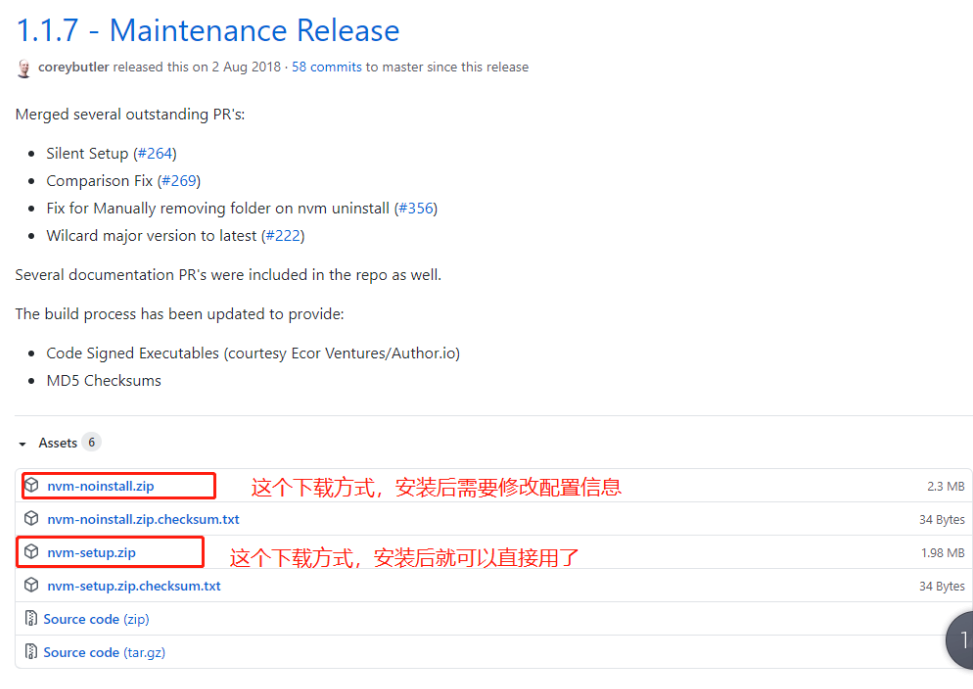

<!--
 * @fileName:
 * @Date: 2023-08-03 10:55:05
 * @Author: manYao.zhu
-->

# node 的版本管理器 nvm

## window 系统下载 nvm【需要使用最新版本， 因为低版本的 nvm 不支持 node16.X 版本的依赖， 安装以上的依赖就会报错】

[最新的下载地址](https://github.com/coreybutler/nvm-windows/releases)



- 可以看到这里又有四个可下载的文件。

```js
nvm-noinstall.zip： 这个是绿色免安装版本，但是使用之前需要配置
nvm-setup.zip：这是一个安装包，下载之后点击安装，无需配置就可以使用，方便。
Source code(zip)：zip 压缩的源码
Sourc code(tar.gz)：tar.gz 的源码，一般用于\*nix 系统
```

- 我对这个目前只是简单使用，为了方便，所以下载了 nvm-set.zip 文件。

## 安装

- nvm-setup.zip 方式安装

下载好解压缩包点击进行安装

安装中第一个目录指定的是 nvm 的安装路径； 第二个目录是 node 的安装目录

档两个都安装好之后， 执行

```js
nvm -v 或 nvm version
```

如果出现 nvm 版本号和一系列帮助指令，则说明 nvm 安装成功。

否则，可能会提示 nvm: command not found

注意： 到此并没有结束： 这个时候我们还需要进入 nvm 目录中修改 settings.txt 文件； 修改如下

```js
root: C:\dev\nvm  // nvm的安装目录
path: C:\dev\nodejs   // nodejs的安装目录
node_mirror:npm.taobao.org/mirrors/node/   // node的淘宝镜像
npm_mirror:npm.taobao.org/mirrors/npm/    // npm的淘宝镜像
```

## 执行命令

```js
nvm arch [32|64] // 显示node是运行在32位还是64位模式。指定32或64来覆盖默认体系结构。
nvm install <version> [arch]  // 该可以是node.js版本或最新稳定版本latest。（可选[arch]）指定安装32位或64位版本（默认为系统arch）。设置[arch]为all以安装32和64位版本。在命令后面添加--insecure ，可以绕过远端下载服务器的SSL验证。
nvm list || nvm ls [available]  //  列出已经安装的node.js版本。可选的available，显示可下载版本的部分列表。这个命令可以简写为nvm ls [available]。
nvm on // 启用node.js版本管理。
nvm off  // 禁用node.js版本管理(不卸载任何东西)
nvm proxy [url]  //  设置用于下载的代理。留[url]空白，以查看当前的代理。设置[url]为none删除代理。
nvm node_mirror [url]  //  设置node镜像，默认为https://nodejs.org/dist/.。我建议设置为淘宝的镜像https://npm.taobao.org/mirrors/node/
nvm npm_mirror [url] //  设置npm镜像，默认为https://github.com/npm/npm/archive/。我建议设置为淘宝的镜像https://npm.taobao.org/mirrors/npm/
nvm uninstall <version>  // 卸载指定版本的nodejs。
nvm use [version> [arch]  //  切换到使用指定的nodejs版本。可以指定32/64位[arch]。nvm use <arch>将继续使用所选版本，但根据提供的值切换到32/64位模式的<arch>
nvm root [path]  // 设置 nvm 存储node.js不同版本的目录 ,如果未设置，将使用当前目录
nvm version  // 显示当前运行的nvm版本，可以简写为nvm v
```

- 常用的命令

```js
nvm list　　//查看目前已经安装的版本
nvm list available //显示可下载版本的部分列表
nvm install 10.15.0 //安装指定的版本的nodejs
nvm use 10.15.0 //使用指定版本的nodejs
npm install -g cnpm --registry=https://registry.npm.taobao.org  //使用淘宝镜像
```

[查看 node 版本列表信息的地址](https://nodejs.org/zh-cn/download/releases/)

## 注意点

当我们通过

```js
nvm use <version>
```

切换了不同版本 node 时， 查看 npm 版本是否同时切了相应版本，若没有的画，我们可以直接到 nvm 目录， 切入到相应版本目录

```js
eg： C:\dev\nvm\v12.18.3\node_modules\npm
```

在查看 npm 的版本，这是就会切刀相对应的版本了
