# npm 登录 添加一次性密码操作

## 第一步

- 登录 npmjs 官网，如果是首次发布就点击头像然后点击 account 选项然后在页面中找到 Enable 2FA 选项并点击；而如果是更新包的话就直接进入自己包的页面然后切换到 setting 页面下，然后就会出现下面的页面：
  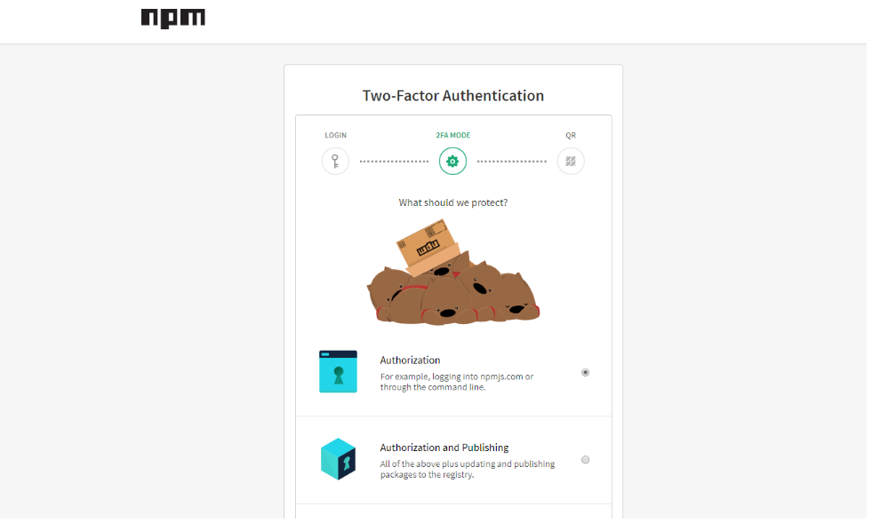

## 第二步

- 选择第一个选项就会出来一个二维码的页面，到这里如果是实现过 2FA 的朋友应该知道怎么做了，[关于 2FA 原理可以参考阮大神的文章](http://www.ruanyifeng.com/blog/2017/11/2fa-tutorial.html)，有时间和精力的朋友可以尝试自己实现一个，没有这方面条件那用现成的吧——打开手机上的浏览器扫描二维码，然后就会进入一个搜索结果页面，在页面中找到如下的软并下载(有 VPN 的也可以使用微软或谷歌的 Authenticator 手机 app):（也可以直接在浏览器中输入： 身份验证器手机版下载 V5.00）
  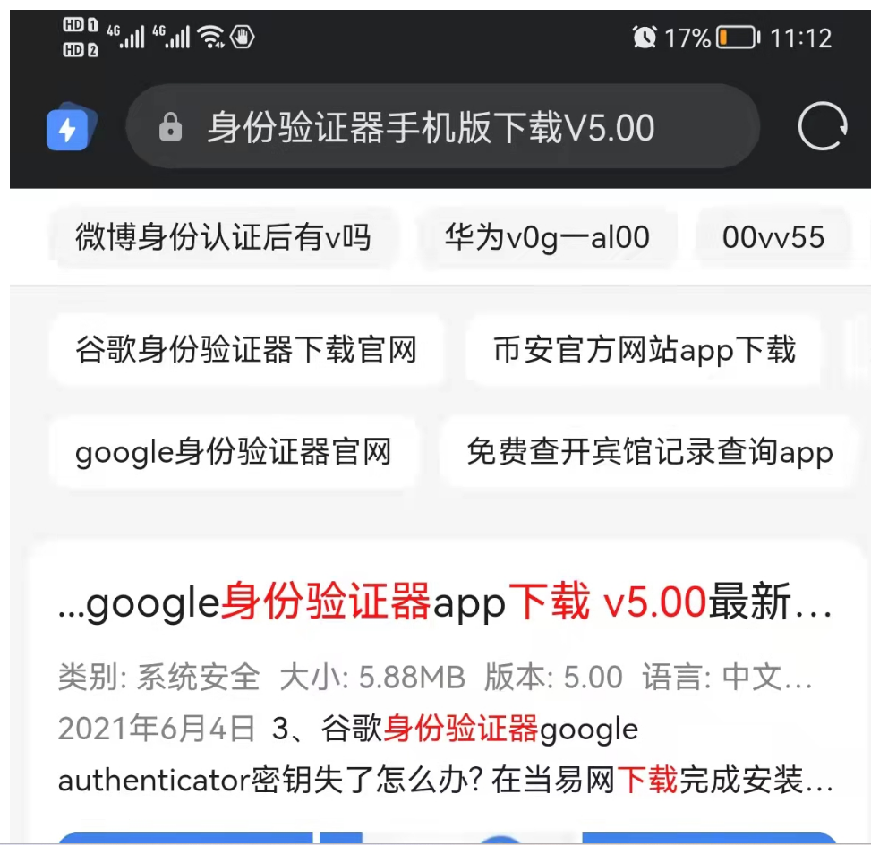

## 第三步

- 打开软件，点击开始然后就会进入添加账号界面，这个软件的二维码功能貌似不可用，所以选择 输入提供的密钥 来添加账号：
  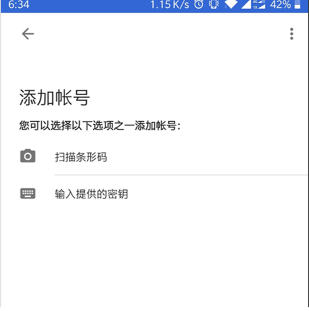

## 第四步

- 然后添加账号的界面中，账号就是你的 npm 账号，而密码并不是你 npm 账号的登录密码，而是扫描二维码时生成那个密钥——在第二步中手机浏览器扫描二维码时，观察浏览器的 url 会发现其中有一个查询字符串 secret：
  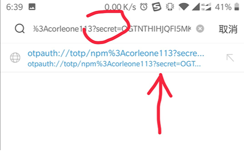

## 第五步

- 复制 url 到密码输入框中，然后删除密钥(screct)值之前的部分
  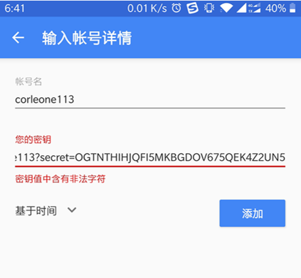

## 第六步

- 然后添加账号就成功了，app 会自动进入显示 2FA 验证码的页面：
  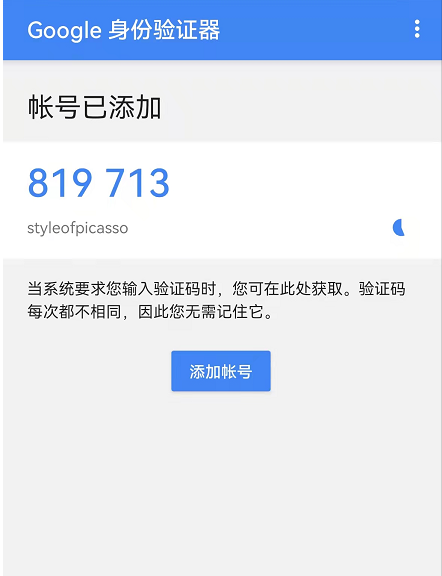

## 第七步

- 返回之前 npmjs 二维码那个页面，然后输入实时验证码：
  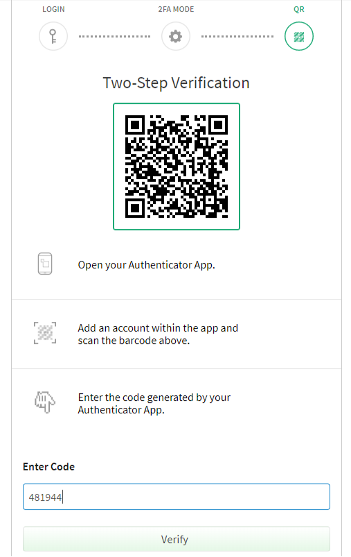

## 第八步

- 到这里就开启 2FA 成功了
  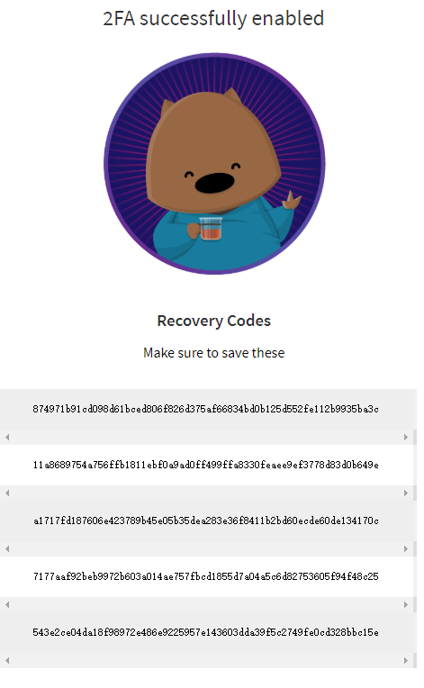

## 第九步

- 接下来你可以在 setting 页面关闭更新包时需要 2FA 验证的选项：
  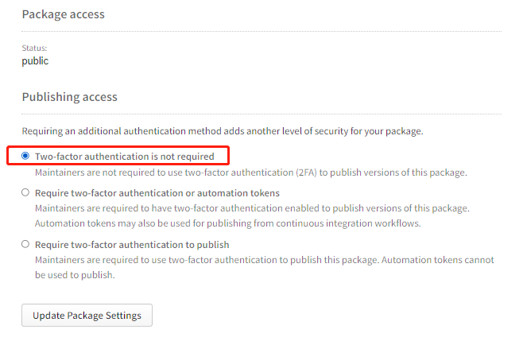

## 第十步

- 发布之前在中台登陆账号是还是需要填写一次行密码的
  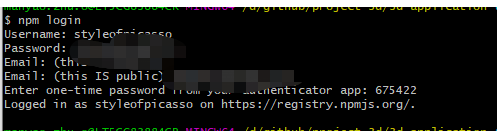

## 第十一步

- 发布成功
  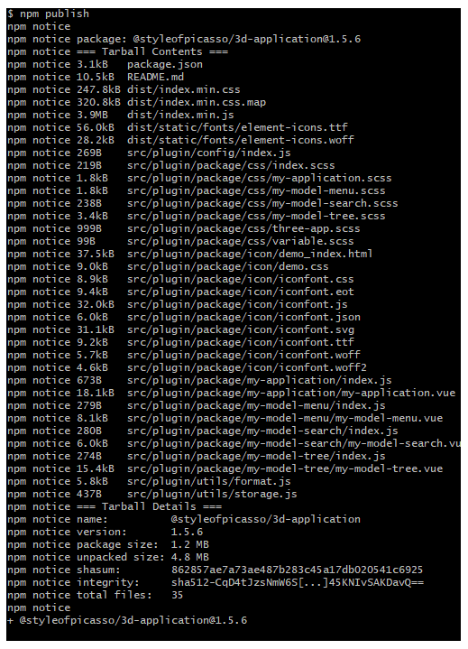
