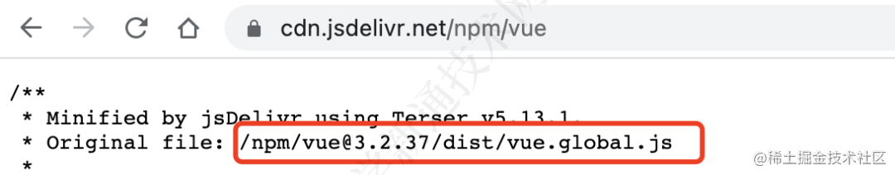

<!--
 * @fileName:
 * @Date: 2023-07-12 17:23:48
 * @Author: manYao.zhu
-->

# package.json 的配置详解

## 配置信息分为 7 大类

- 脚手配置
- 描述配置
- 文件配置
- 脚本配置
- 依赖配置
- 发布配置
- 系统配置
- 第三方配置

## 脚手配置

- 脚手配置，bin 主要是在配置脚手架的配置信息 (配置了脚手架的名称 与 脚手架入口)

```js
{
  "bin": {
    "my-cli": "bin/index.js"  // my-cli —— 脚手架的名称，  'bin/index.js' —— 脚手架的入口
  }
}
```

- 脚手架入口文件中， 需要备注如下信息

```js
// bin/index.js 文件

#! /usr/bin/env node

// #! 符号的名称叫 Shebang，用于指定脚本的解释程序
// Node CLI 应用入口文件必须要有这样的文件头
```

## 描述配置

- 描述配置主要是基本信息， 包括：名称、版本、描述、仓库、作者、关键词、项目主页的链接、项目 bug 反馈地址、[项目的开源许可证](https://www.ruanyifeng.com/blog/2011/05/how_to_choose_free_software_licenses.html)

```js
{
  "name": "@styleofpicasso/vue-theme",
  "version": "0.0.1",
  "description": "a application of vue",
  "repository": {
     "type": "git",
     "url": "https://github.com/styleofpicasso/vue-theme.git",
      "directory": "packages/react"
  },
  "author": "manyao.zhu",
  "keywords": [
    "vue-theme",
    "theme"
  ],
  "homepage": "https://vue.org",  // 项目主页的链接，通常是项目 github 链接，项目官网或文档首页
  "bugs": "https://github.com/styleofpicasso/vue-theme/issues",  // 项目 bug 反馈地址，通常是 github issue 页面的链接。
  "license": "MIT",  // 项目的版权拥有人可以使用开源许可证来限制源码的使用、复制、修改和再发布等行为
}
```

## 文件配置

- 文件配置信息主要包括： files、type、main、browser、module、exports、workspaces

- exports 的权重大于 files, 当设置 exports 之后， files 将会失效 —— 即： 当设置了 exports 之后， 之后在 exports 中声明了的才可以使用， 否则的话都会报错

```js
{
  "files": [
    "theme-chalk",
    "es",
    "utils/common/markdown.js"
  ],
  "type": "module",
  "main": "es/index.es.js",
  "browser": "browser/index.js",
  "module": "es/index.es.js",
  "export": {
    ".": {
      "require": "./es/index.umd.sj",
      "import": "./es/index.es.js"
    },
    "./es/": "./es/",
    "./utils/common/*": "./utils/common/*.js",
    "./theme-chalk/": "./theme-chalk/"
  },
  "workspaces": [
    "packages/*"
  ]
}
```

1. **files** : 项目在进行 npm 发布时，可以通过 files 指定需要跟随一起发布的内容来控制 npm 包的大小，避免安装时间太长。

   发布时默认会包括 package.json，license，README 和 main 字段里指定的文件。忽略 node_modules，lockfile 等文件。

   在此基础上，我们可以指定更多需要一起发布的内容。可以是单独的文件，整个文件夹，或者使用通配符匹配到的文件。

2. **type** : 在 node 支持 ES 模块后，要求 ES 模块采用 .mjs 后缀文件名。只要遇到 .mjs 文件，就认为它是 ES 模块。如果不想修改文件后缀，就可以在 package.json 文件中，指定 type 字段为 module。

   这样所有 .js 后缀的文件，node 都会用 ES 模块解释。

   如果还要使用 CommonJS 模块规范，那么需要将 CommonJS 脚本的后缀名都改成.cjs，不过两种模块规范最好不要混用，会产生异常报错。

3. **main** ：项目发布时，默认会包括 package.json，license，README 和 main 字段里指定的文件，因为 main 字段里指定的是项目的入口文件，在 browser 和 Node 环境中都可以使用。

   如果不设置 main 字段，那么入口文件就是根目录下的 index.js。

   这是早期只有 CommonJS 模块规范时，指定项目入口的唯一属性。

4. **browser** : main 字段里指定的入口文件在 browser 和 Node 环境中都可以使用。如果只想在 web 端使用，不允许在 server 端使用，可以通过 browser 字段指定入口。

5. **module** : 同样，项目也可以指定 ES 模块的入口文件，这就是 module 字段的作用。

   当一个项目同时定义了 main，browser 和 module，像 webpack，rollup 等构建工具会感知这些字段，并会根据环境以及不同的模块规范来进行不同的入口文件查找。

6. **exports** : node 在 14.13 支持在 package.json 里定义 exports 字段，拥有了条件导出的功能

   exports 字段可以配置不同环境对应的模块入口文件，并且当它存在时，它的优先级最高。

   比如使用 require 和 import 字段根据模块规范分别定义入口：

   ```ts
   {
     "exports": {
        "require": "./index.js",
        "import": "./index.mjs"
     }
   }
   ```

   这样的配置在使用 import 'xxx' 和 require('xxx') 时会从不同的入口引入文件，exports 也支持使用 browser 和 node 字段定义 browser 和 Node 环境中的入口。

   上方的写法其实等同于：

   ```js
   {
     "exports": {
        ".": {
          "require": "./index.js",
          "import": "./index.mjs"
       }
     }
   }
   ```

   为什么要加一个层级，把 require 和 import 放在 "." 下面呢？

   因为 exports 除了支持配置包的默认导出，还支持配置包的子路径。

   比如一些第三方 UI 包需要引入对应的样式文件才能正常使用。

   ```js
     import `@styleofpicasso/vue-theme/dist/css/index.css`;
   ```

   我们可以使用 exports 来封装文件路径：

   ```js
   "exports": {
    "./style": "./dist/css/index.css'
   },
   ```

   用户引入时只需：

   ```js
     import `@styleofpicasso/vue-theme/style`;
   ```

   除了对导出的文件路径进行封装，exports 还限制了使用者不可以访问未在 "exports" 中定义的任何其他路径。

   比如发布的 dist 文件里有一些内部模块 dist/internal/module ，被用户单独引入使用的话可能会导致主模块不可用。为了限制外部的使用，我们可以不在 exports 定义这些模块的路径，这样外部引入 packageA/dist/internal/module 模块的话就会报错。

7. **workspaces** : 项目的工作区配置，用于在本地的根目录下管理多个子项目。可以自动地在 npm install 时将 workspaces 下面的包，软链到根目录的 node_modules 中，不用手动执行 npm link 操作

   workspaces 字段接收一个数组，数组里可以是文件夹名称或者通配符。比如：

   ```js
    "workspaces": [
      "workspace-a"
    ]
   ```

   表示在 workspace-a 目录下还有一个项目，它也有自己的 package.json。

   ```js
    package.json
    workspace-a
      └── package.json
   ```

   通常子项目都会平铺管理在 packages 目录下，所以根目录下 workspaces 通常配置为：

   ```js
    "workspaces": [
      "packages/*"
    ]
   ```

## 脚本配置

- 脚本配置主要包括：scripts、config

```js
{
  "scripts": {
    "dev": "node index.js"
    "build": "***"
  },
  "config": {
    "port": "3030"
  }
}
```

- **scripts** ：指定项目的一些内置脚本命令，这些命令可以通过 npm run 来执行。通常包含项目开发，构建 等 CI 命令
- **config** : config 用于设置 scripts 里的脚本在运行时的参数

## 依赖配置

- 依赖配置主要包括：运行依赖、开发依赖、同伴依赖、可选依赖、打包依赖

```js
{
  "dependencies": {
    "vue": "^3.2.43"
  },
  "devDependencies": {
    "webpack": "^5.2.24",
    "vite": "^3.0.2"
  },
  "peerDependencies": {
    "react": ">=16.9.0",
    "react-dom": ">=16.9.0"
  },
  "optionalDependencies": {
    "colors": "^1.4.0"
  },
  "peerDependenciesMeta": {
    "colors": {
      "optional": true
    }
  },
  "bundleDependencies": [
    "react",
    "react-dom"
  ]
}
```

- **dependencies** : 运行依赖，也就是项目生产环境下需要用到的依赖. 使用 npm install xxx 或则 npm install xxx --save 安装
- **devDependencies** : 开发依赖，项目开发环境需要用到而运行时不需要的依赖，用于辅助开发，通常包括项目工程化工具比如 webpack，vite，eslint 等。 使用 npm install xxx -D 或者 npm install xxx --save-dev 安装
- **peerDependencies** : 同伴依赖，一种特殊的依赖，不会被自动安装，通常用于表示与另一个包的依赖与兼容性关系来警示使用者。

  比如我们安装 A，A 的正常使用依赖 B@2.x 版本，那么 B@2.x 就应该被列在 A 的 peerDependencies 下，表示“如果你使用我，那么你也需要安装 B，并且至少是 2.x 版本”。

  比如 React 组件库 Ant Design，它的 package.json 里 peerDependencies 为

  ```js
    "peerDependencies": {
      "react": ">=16.9.0",
      "react-dom": ">=16.9.0"
    }
  ```

  表示如果你使用 Ant Design，那么你的项目也应该安装 react 和 react-dom，并且版本需要大于等于 16.9.0。

- **optionalDependencies** : 可选依赖，顾名思义，表示依赖是可选的，它不会阻塞主功能的使用，安装或者引入失败也无妨。这类依赖如果安装失败，那么 npm 的整个安装过程也是成功的。

  比如我们使用 colors 这个包来对 console.log 打印的信息进行着色来增强和区分提示，但它并不是必需的，所以可以将其加入到 optionalDependencies，并且在运行时处理引入失败的逻辑。

  使用 npm install xxx -O 或者 npm install xxx --save-optional 进行安装

- **peerDependenciesMeta** ：同伴依赖也可以使用 peerDependenciesMeta 将其指定为可选的。

  ```js
  "`peerDependencies": {
    "colors": "^1.4.0"
  },
  "peerDependenciesMeta": {
    "colors": {
      "optional": true
    }
  }`
  ```

- **bundleDependencies** : 打包依赖。它的值是一个数组，在发布包时，bundleDependencies 里面的依赖都会被一起打包

  比如指定 react 和 react-dom 为打包依赖：

  ```js
  "bundleDependencies": [  // 需要注意的是，这个字段数组中的值必须是在 dependencies，devDependencies 两个里面声明过的依赖才行。
    "react",
    "react-dom"
  ]
  ```

  在执行 npm pack 打包生成 tgz 压缩包中，将出现 node_modules 并包含 react 和 react-dom。

  普通依赖通常从 npm registry 安装，但当你想用一个不在 npm registry 里的包，或者一个被修改过的第三方包时，打包依赖会比普通依赖更好用。

## 发布配置

- 发布配置主要包括：private、publishConfig

```js
{
  "private": true,
  "publishConfig": {
    "registry": "https://registry.npmjs.org/"
  }
}
```

- **private** : 如果是私有项目，不希望发布到公共 npm 仓库上，可以将 private 设为 true。

- **publishConfig** : 顾名思义，publishConfig 就是 npm 包发布时使用的配置

  比如在安装依赖时指定了 registry 为 taobao 镜像源，但发布时希望在公网发布，就可以指定 publishConfig.registry。

  ```js
  "publishConfig": {
    "registry": "https://registry.npmjs.org/"
  }
  ```

## 系统配置

和项目关联的系统配置，比如 node 版本或操作系统兼容性之类。这些要求只会起到提示警告的作用，即使用户的环境不符合要求，也不影响安装依赖包。

- 系统配置主要包括： engines、os、cpu

```js
{
  "engines": {
    "node": ">=14 <16",
    "pnpm": ">7"
  },
  "os": ["darwin", "linux"],
  "cpu": ["x64", "ia32"]
}
```

- **engines** : 一些项目由于兼容性问题会对 node 或者包管理器有特定的版本号要求，比如：

  ```js
  "engines": {
    "node": ">=14 <16",
    "pnpm": ">7"
  }
  ```

  要求 node 版本大于等于 14 且小于 16，同时 pnpm 版本号需要大于 7。

- **os** : 在 linux 上能正常运行的项目可能在 windows 上会出现异常，使用 os 字段可以指定项目对操作系统的兼容性要求。

  ```js
  "os": ["darwin", "linux"]
  ```

- **cpu** : 指定项目只能在特定的 CPU 体系上运行
  ```js
  "cpu": ["x64", "ia32"]
  ```

## 第三方配置

一些第三方库或应用在进行某些内部处理时会依赖这些字段，使用它们时需要安装对应的第三方

- 第三方配置主要包括： types 或 typings、unpkg、jsdelivr、browserslist、sideEffects、lint-staged、

```js
  "types": "./index.d.ts",
  "unpkg": "dist/vue.global.js",
  "jsdelivr": "dist/vue.global.js",
  "browserslist": [
    "> 1%",
    "last 2 versions"
  ],
  "sideEffects": [
    "dist/*",
    "es/**/style/*",
    "lib/**/style/*",
    "*.less"
  ],
  "lint-staged": {
    "src/**/*.{js,jsx,ts,tsx}": [
      "eslint --fix",
      "git add -A"
    ]
  }
```

- **types** ：指定 TypeScript 的类型定义的入口文件
- **unpkg** : 可以让 npm 上所有的文件都开启 CDN 服务。

  比如 vue package.json 的 unpkg 定义为 dist/vue.global.js

  ```js
  "unpkg": "dist/vue.global.js",
  ```

  当我们想通过 CDN 的方式使用链接引入 vue 时。

  访问 https://unpkg.com/vue 会重定向到 https://unpkg.com/vue@3.2.37/dist/vue.global.js，其中 3.2.27 是 Vue 的最新版本。

- **jsdelivr** : 与 unpkg 类似，vue 通过如下的配置

  ```js
  "jsdelivr": "dist/vue.global.js",
  ```

  访问 https://cdn.jsdelivr.net/npm/vue 实际上获取到的是 jsdelivr 字段里配置的文件地址
  

- **browserslist** : 设置项目的浏览器兼容情况。babel 和 autoprefixer 等工具会使用该配置对代码进行转换。当然你也可以使用 .browserslistrc 单文件配置。
  ```js
  "browserslist": [
    "> 1%",
    "last 2 versions"
  ]
  ```
- **sideEffects** : 显示设置某些模块具有副作用，用于 webpack 的 tree-shaking 优化。

  比如在项目中整体引入 Ant Design 组件库的 css 文件。

  ```js
  import 'antd/dist/antd.css' // or 'antd/dist/antd.less'
  ```

  如果 Ant Design 的 package.json 里不设置 sideEffects，那么 webapck 构建打包时会认为这段代码只是引入了但并没有使用，可以 tree-shaking 剔除掉，最终导致产物缺少样式。

  所以 Ant Design 在 package.json 里设置了如下的 sideEffects，来告知 webpack，这些文件具有副作用，引入后不能被删除。

  ```js
  "sideEffects": [
    "dist/*",
    "es/**/style/*",
    "lib/**/style/*",
    "*.less"
  ]
  ```

- **lint-staged** : lint-staged 是用于对 git 的暂存区的文件进行操作的工具，比如可以在代码提交前执行 lint 校验，类型检查，图片优化等操作。

  ```js
  "lint-staged": {
    "src/**/*.{js,jsx,ts,tsx}": [
      "eslint --fix",
      "git add -A"
    ]
  }
  ```

  lint-staged 通常配合 husky 这样的 git-hooks 工具一起使用。git-hooks 用来定义一个钩子，这些钩子方法会在 git 工作流程中比如 pre-commit，commit-msg 时触发，可以把 lint-staged 放到这些钩子方法中。
