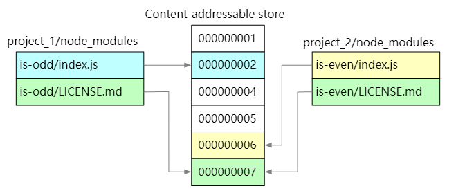
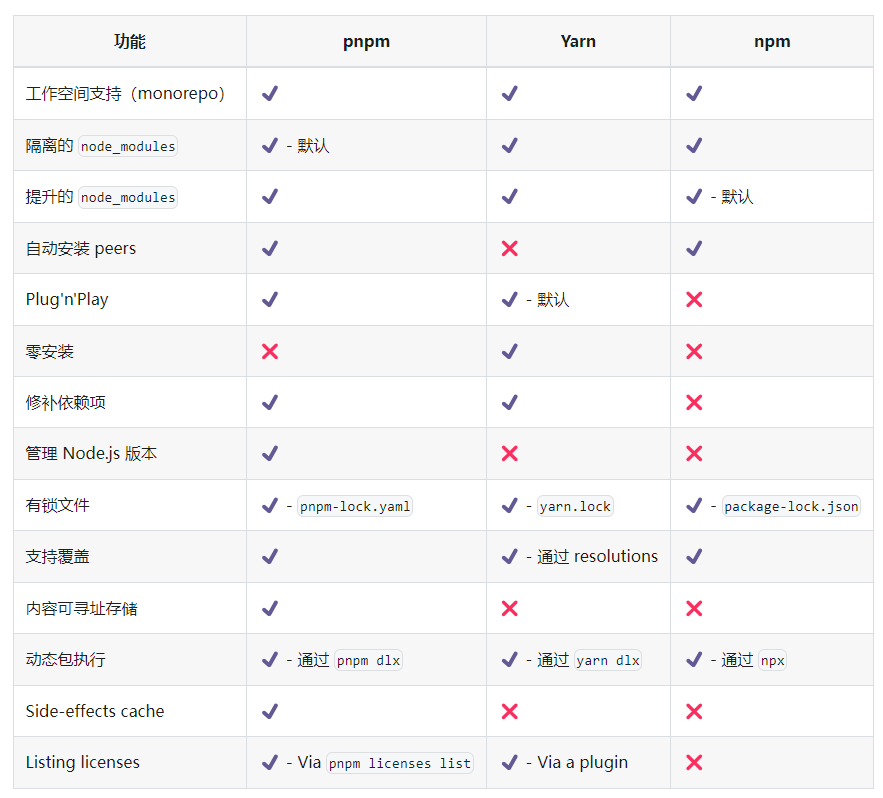

<!--
 * @fileName:
 * @Date: 2023-08-11 16:51:37
 * @Author: manYao.zhu
-->

# pnpm 的使用教程

## 官网教程

[官网地址：https://pnpm.io/zh/](https://pnpm.io/zh/)

## 使用 pnpm 的目的 —— 节省磁盘空间



- 使用 npm 时，依赖每次被不同的项目使用，都会重复安装一次。

- 而在使用 pnpm 时，依赖会被存储在内容可寻址的存储中， 所以：

如果你用到了某依赖项的不同版本，只会将不同版本间有差异的文件添加到仓库。 例如，如果某个包有 100 个文件，而它的新版本只改变了其中 1 个文件。那么 pnpm update 时只会向存储中心额外添加 1 个新文件，而不会因为仅仅一个文件的改变复制整新版本包的内容。

所有文件都会存储在硬盘上的某一位置。 当软件包被被安装时，包里的文件会硬链接到这一位置，而不会占用额外的磁盘空间。 这允许你跨项目地共享同一版本的依赖。

- 因此，您在磁盘上节省了大量空间，这与项目和依赖项的数量成正比，并且安装速度要快得多！

## 安装 pnpm

- 前端使用 node 安装时， node 的版本最低需要支持 16.X 版本

- npm 安装

```js
npm install pnpm -g
// 或
npm install @pnpm/exe -g
```

## 功能对比



## pnpm 的命令

[pnpm 的具体操作指令看这里](https://pnpm.nodejs.cn/)
