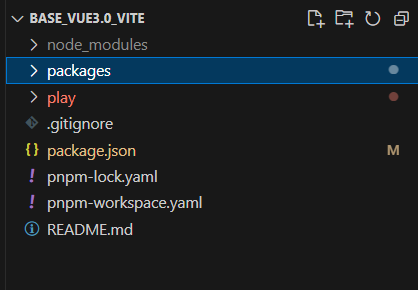
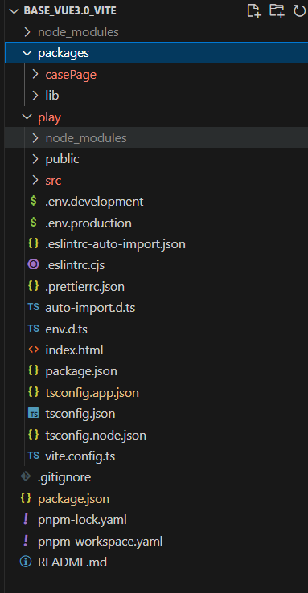
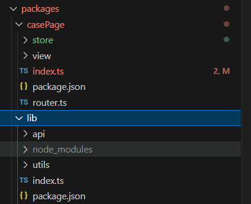
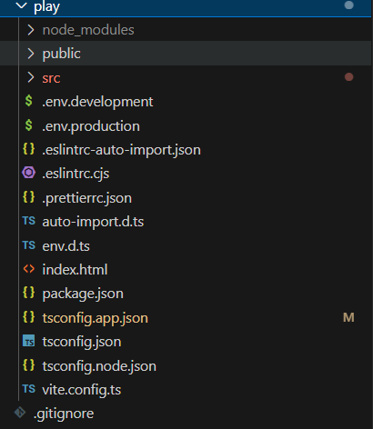

<!--
 * @Date: 2023-10-07 16:52:46
 * @LastEditors: zhumanyao
 * @LastEditTime: 2023-10-18 18:14:27
 * @FilePath: \ocean-of-knowledge\docs\knowledge-module\node\pnpm\submodule.md
-->

# vue 基于 pnpm 搭建的本地 submodules(子工程)，

## 框架结构

- 整体结构
  

- 完整结构
  

- packages 的内部结构



- play 展示层的内部结构， 与正常的 vue 一样
  

## 构建 submodule 分包处理的基础思路

- 根目录下创建 pnpm-workspace.yaml 文件， 将需要创建 workspace 的工作区间就行注册连接

```js
// 含义： 将packages 文件夹下的文件与 play文件夹的文件进行连接
packages:
  # all packages in direct subdirs of packages/
  - 'packages/*'
  # all packages in subdirs of components/
  - 'play/**'
  # exclude packages that are inside test directories
  - '!**/test/**'

```

- 在每个自定义的包内创建 index.ts （用于将所有的内容进行暴露出去） 与 package.json （将入口暴露出去） 文件， 这里以 lib 包举例

```js
// packages/lib/index.ts
export { *** }

// package.json
{
  "name": "@sop/lib",  // 自定义包的名称
  "private": true,  // 是否私有
  "version": "0.0.1",  // 包的版本
  "main": "./index.ts",  // 暴露包的入口， commonjs规范使用
  "module": "./index.ts",  // 暴露包的入口  ESM 规范使用
  "types": "./index.d.ts",  // 定义属性的入口文件
  "files": [],
  "scripts": {},
  "dependencies": {},  // 项目开发依赖， 保内使用的最好放在这里面
  "devDependencies": {}  // 项目本地开发依赖，
}

```

- 主包下的的 package.json 添加以下配置（根目录下）

```js
// package.json

{
  "dependencies": {
+   "@sop/lib": "workspace:^",
  }
}
```

- 都配置完之后， 需要在根目录下重新安装依赖， 来软连接这个包 (需要注意： 当相关配置修改或者添加新的包与配置， 也需要重新执行安装命令)

```js
pnpm install
```
