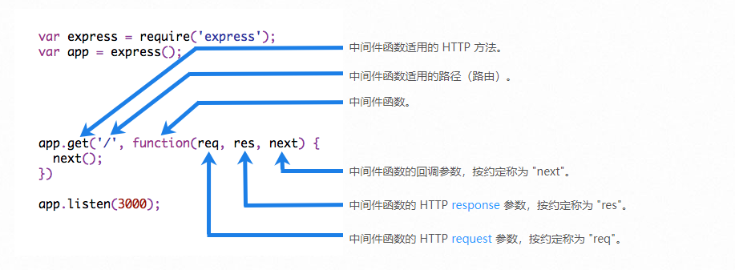

# Express 前端框架教程

## nodemon 插件 —— 自动监听服务端修改， 然后自动重启服务终端

- 安装依赖 （全局安装， 这样就不需要每个项目都安装了， 所有 node 启动的服务皆可以用）

```js
npm install nodemon -g
```

## 引入 express, 注册 express 的实例

```js
const express = require('express')
const app = express() // 后面的app皆是express的实例
```

## express 的基本路由

- 概念： 路由是指确定应用如何响应客户端对特定端点的请求，该端点是 URI（或路径）和特定的 HTTP 请求方法（GET、POST 等）

- 自定义路由结构

```js
app.METHOD(path, handler)
```

`METHOD 是小写的 HTTP 请求方法。path 是服务器上的路径。 handler 是路由匹配时执行的函数`

- 以下是基本路由的案例

```js
// 响应根路由(/)上的GET请求，
app.get('/', (req, res) => {
  res.send('Hello World')
})

// 响应根路由（/）上的 POST 请求
app.post('/', (req, res) => {
  res.send('Got a POST request')
})

// 响应对 /user 路由的 PUT 请求：
app.put('/user', (req, res) => {
  res.send('Got a PUT request at /user')
})

// 响应对 /user 路由的 DELETE 请求：
app.delete('/user', (req, res) => {
  res.send('Got a DELETE request at /user')
})
```

## 路由晋级

[有关路由的更多详细信息，请参阅 路由指南](https://express.nodejs.cn/en/guide/routing.html)

- 特殊路由 1

```js
app.all(path, handler)
```

`有一种特殊的路由方法，app.all()，用于在所有 HTTP 请求方法的路径上加载中间件函数。 例如，无论使用 GET、POST、PUT、DELETE 还是 http 模块 中支持的任何其他 HTTP 请求方法，都会对路由 “/secret” 的请求执行以下处理程序`

```js
// 这个特殊的函数就可以在浏览器请求接口之前， 针对/secret服务下的所有接口进行处理， 从而实现自己想要的效果  handler: 可以认为是一个中间件
app.all('/secret/*', (req, res, next) => {
  console.log('Accessing the secret section ...')
  next() // pass control to the next handler
})
```

- app.route()

```js
app.route(path).handler.hander // handler: 路由的处理程序
```

`可以使用 app.route() 为路由路径创建可链接的路由处理程序。`

```js
// 利用app.route() 创建了三种接口， 获取、创建、更新三个接口
app
  .route('/book')
  .get((req, res) => {
    res.send('Get a random book')
  })
  .post((req, res) => {
    res.send('Add a book')
  })
  .put((req, res) => {
    res.send('Update the book')
  })
```

## 路由的处理程序 (亦可认为是路由级的中间件函数)

- 单个回调函数可以处理路由

```js
app.get('/example', (req, res) => {
  res.send('Hello World')
})
```

- 多个回调函数可以处理一个路由

```js
app.get(
  '/example',
  (req, res, next) => {
    console.log('do something, the response will be sent by the next function ...')
    next()
  },
  (req, res) => {
    res.send('Hello World')
  }
)
```

- 一组回调函数可以处理一个路由

```js
const cb0 = (req, res, next) => {
  console.log('doing something')
  next()
}

const cb1 = (req, res, next) => {
  console.log('doing some things')
  next()
}

const cb2 = (req, res) => {
  console.log('done')
  res.send('Hello World')
}

app.get('/example', [cb0, cb1, cb2])
```

- 独立函数和函数数组的组合可以处理路由

```js
const cb0 = function (req, res, next) {
  console.log('CB0')
  next()
}

const cb1 = function (req, res, next) {
  console.log('CB1')
  next()
}

app.get(
  '/example/d',
  [cb0, cb1],
  (req, res, next) => {
    console.log('the response will be sent by the next function ...')
    next()
  },
  (req, res) => {
    res.send('Hello World')
  }
)
```

## 路由的相应方法

| 方法                                                                        | 描述                                                 |
| --------------------------------------------------------------------------- | ---------------------------------------------------- |
| [res.download()](https://express.nodejs.cn/en/4x/api.html#res.download)     | 提示要下载的文件。                                   |
| [res.end()](https://express.nodejs.cn/en/4x/api.html#res.end)               | 结束响应过程。                                       |
| [res.json()](https://express.nodejs.cn/en/4x/api.html#res.json)             | 发送 JSON 响应。                                     |
| [res.jsonp()](https://express.nodejs.cn/en/4x/api.html#res.jsonp)           | 发送带有 JSONP 支持的 JSON 响应。                    |
| [res.redirect()](https://express.nodejs.cn/en/4x/api.html#res.redirect)     | 重定向请求。                                         |
| [res.render()](https://express.nodejs.cn/en/4x/api.html#res.render)         | 渲染视图模板。                                       |
| [res.send()](https://express.nodejs.cn/en/4x/api.html#res.send)             | 发送各种类型的响应。                                 |
| [res.sendFile()](https://express.nodejs.cn/en/4x/api.html#res.sendFile)     | 将文件作为八位字节流发送。                           |
| [res.sendStatus()](https://express.nodejs.cn/en/4x/api.html#res.sendStatus) | 设置响应状态码并将其字符串表示形式作为响应正文发送。 |

[全部响应方法可参考：响应方法](https://express.nodejs.cn/en/4x/api.html#res.append)

## 路由的模块化 express.Router()

- 使用 express.Router 类创建模块化、可安装的路由处理程序。 一个 Router 实例就是一个完整的中间件和路由系统； 因此，它通常被称为 “mini-app”。

- 案例： 在 app 目录下创建一个名叫 birds.js 的路由文件

```js
const express = require('express')
const router = express.Router()

// middleware that is specific to this router  该模块下的中间件，处理该模块需要特殊的处理逻辑
router.use((req, res, next) => {
  console.log('Time: ', Date.now())
  next()
})
// define the home page route
router.get('/get', (req, res) => {
  res.send('Birds home page')
})
// define the about route
router.get('/about', (req, res) => {
  res.send('About birds')
})

module.exports = router
```

- 在应用中加载路由模块

```js
const express = reuqire('express')
const app = express()

app.use('/birds', require('./birds'))

app.listen(3000, 'localhost', () => {
  console.log('应用启动')
})
```

## Router()

- Router 主要是将路由模块化， Router 实例具备的方法与 express 实例相同， all()、METHOD()、param()【从 Express v4.11.0 开始不推荐使用此方法】、route()、use()

[Router() 方法](https://express.nodejs.cn/en/4x/api.html#router)

## 静态文件

- 获取静态文件的内置中间件 函数签名

```js
express.static(root, [options])
```

`root 参数指定提供静态资源的根目录。 有关 options 参数的更多信息，请参阅`[express.static](https://express.nodejs.cn/en/4x/api.html#express.static)

- 使用 public 文件夹下的静态资源

```js
app.use(express.static('public'))
```

```js
http://localhost:3000/images/kitten.jpg
http://localhost:3000/css/style.css
http://localhost:3000/js/app.js
http://localhost:3000/images/bg.png
http://localhost:3000/hello.html
```

- 要使用多个静态资源目录，请多次调用 express.static 中间件函数：

```js
app.use(express.static('public'))
app.use(express.static('files'))
```

- 指定 static 前缀，阅读 public 文件夹下的静态资源

```js
app.use('/static', express.static('public'))
```

```js
http://localhost:3000/static/images/kitten.jpg
http://localhost:3000/static/css/style.css
http://localhost:3000/static/js/app.js
http://localhost:3000/static/images/bg.png
http://localhost:3000/static/hello.html
```

- 以上提供给 express.static 函数的路径是相对于你启动 node 进程的目录的。 如果你从另一个目录运行 express 应用，使用你要服务的目录的绝对路径会更安全：

```js
const path = require('path')
app.use('/static', express.static(path.join(__dirname, 'public')))
```

## 编写中间件

- 中间件的概念： 中间件函数是在应用的请求-响应周期中可以访问 请求对象 (req)、响应对象 (res) 和 next 函数的函数。 next 函数是 Express 路由中的一个函数，当被调用时，它会在当前中间件之后执行中间件。

- 中间件的构建元素



[中间件的编译的其他细节可以查看中间件的编辑](https://express.nodejs.cn/en/guide/writing-middleware.html)

## 使用中间件

- Express 是一个路由和中间件 Web 框架，其自身功能最少： Express 应用本质上是一系列中间件函数调用。

- 中间件函数是可以访问应用请求-响应周期中的 请求对象 (req)、响应对象 (res) 和下一个中间件函数的函数。 下一个中间件函数通常由一个名为 next 的变量表示。

#### 应用级中间件

- 概念： 使用 app.use() 和 app.METHOD() 函数将应用级中间件绑定到 app 对象 的实例，其中 METHOD 是中间件函数处理的请求的 HTTP 方法（如 GET、PUT 或 POST），小写。

- 可以挂在没有路径的中间件函数

```js
const express = require('express')
const app = express()

app.use((req, res, next) => {
  console.log('Time:', Date.now())
  next()
})
```

- 挂在在 /user/:id 路径上的中间件函数

```js
app.use('/user/:id', (req, res, next) => {
  console.log('Request Type:', req.method)
  next()
})
```

- 一个路由和它的处理函数（中间件系统）， 该函数处理对 /user/:id 路径的 GET 请求。

```js
app.use('/user/:id', (req, res) => {
  res.send('Hello World')
})
```

- 在挂载点加载一系列中间件函数的示例，带有挂载路径。 它说明了一个中间件子堆栈，它将任何类型的 HTTP 请求的请求信息打印到 /user/:id 路径

```js
app.use(
  '/user/:id',
  (req, res, next) => {
    console.log('Request URL:', req.originalUrl)
    next()
  },
  (req, res, next) => {
    console.log('Request Type:', req.method)
    next()
  }
)
```

- 路由处理程序使你能够为路径定义多个路由。 下面的示例定义了两条到 /user/:id 路径的 GET 请求路由。 第二个路由不会引起任何问题，但它永远不会被调用，因为第一个路由结束了请求-响应周期。

```js
app.get(
  '/user/:id',
  (req, res, next) => {
    console.log('ID:', req.params.id)
    next()
  },
  (req, res, next) => {
    res.send('User Info')
  }
)

// handler for the /user/:id path, which prints the user ID
app.get('/user/:id', (req, res, next) => {
  res.send(req.params.id)
})
```

- 要跳过路由中间件堆栈中的其余中间件函数，请调用 next('route') 将控制权传递给下一个路由。 `注意： next('route') 将仅在使用 app.METHOD() 或 router.METHOD() 函数加载的中间件函数中工作。`

```js
app.get(
  '/user/:id',
  (req, res, next) => {
    // if the user ID is 0, skip to the next route
    if (req.params.id === '0') next('route')
    // otherwise pass the control to the next middleware function in this stack
    else next()
  },
  (req, res, next) => {
    // send a regular response
    res.send('regular')
  }
)

// handler for the /user/:id path, which sends a special response
app.get('/user/:id', (req, res, next) => {
  res.send('special')
})
```

- 中间件也可以在数组中声明以实现可重用性。

```js
function logOriginalUrl(req, res, next) {
  console.log('Request URL:', req.originalUrl)
  next()
}

function logMethod(req, res, next) {
  console.log('Request Type:', req.method)
  next()
}

const logStuff = [logOriginalUrl, logMethod]
app.get('/user/:id', logStuff, (req, res, next) => {
  res.send('User Info')
})
```

#### 路由级中间件

- 路由级中间件的工作方式与应用级中间件相同，只是它绑定到 express.Router() 的实例。

- 使用 router.use() 和 router.METHOD() 函数加载路由级中间件。

- 具体操作可以参考 [路由的处理程序](https://express.nodejs.cn/en/guide/routing.html)

#### 错误处理中间件

- 以与其他中间件函数相同的方式定义错误处理中间件函数，除了使用四个参数而不是三个参数，特别是使用签名 (err, req, res, next)

```js
app.use((err, req, res, next) => {
  console.error(err.stack)
  res.status(500).send('Something broke!')
})
```

- 具体的可参考[错误处理](https://express.nodejs.cn/en/guide/error-handling.html)

#### 内置中间件

- [具体的中间件可以参考](https://express.nodejs.cn/en/4x/api.html#express)

#### 三方中间件

```js
const express = require('express')
const app = express()
const cors = require('cors')

// load the cors middleware
app.use(cors())
```

## 重写 Express API

[详细可参考：重写 Express API ](https://express.nodejs.cn/en/guide/overriding-express-api.html)

## Express 应用生成器

[详细可参考：Express 应用生成器](https://express.nodejs.cn/en/starter/generator.html)

## 使用 Express 模板引擎

[详细可参考：使用 Express 模板引擎](https://express.nodejs.cn/en/guide/using-template-engines.html)

## Express 开发调试

[详细可参考：Express 开发调试](https://express.nodejs.cn/en/guide/debugging.html)

## 代理背后的 Express

[详细可参考：代理背后的 Express](https://express.nodejs.cn/en/guide/behind-proxies.html)

## Express 应用的进程管理器

[详细可参考：Express 应用的进程管理器](https://express.nodejs.cn/en/advanced/pm.html)

## Express 应用服务 对数据库的集成

[详细可参考：Express 数据库的集成](https://express.nodejs.cn/en/guide/database-integration.html)
