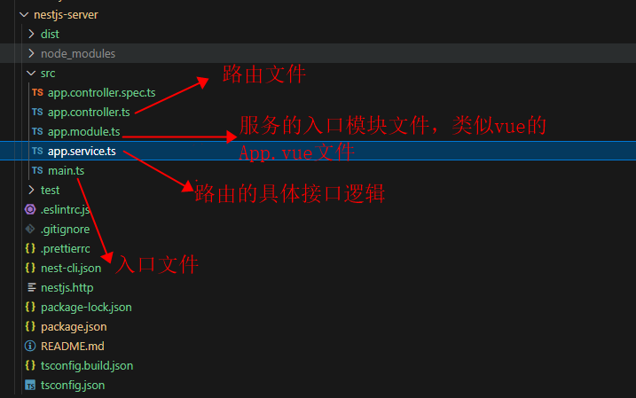
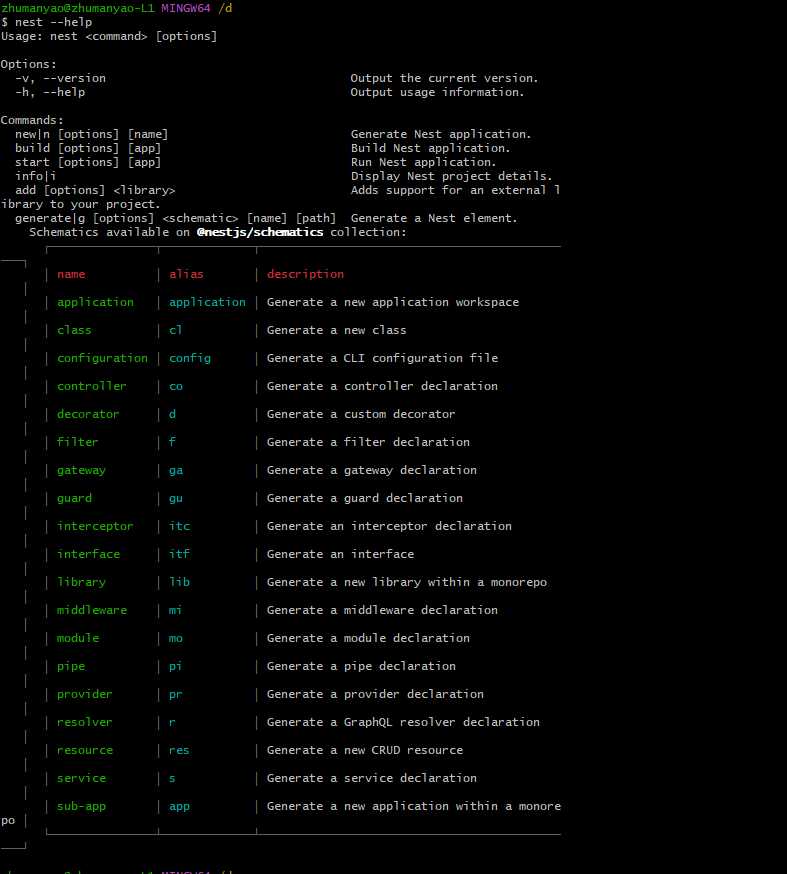

## NestJs 的设计模式 (IOC DI)

- IOC 控制反转 与 DI 依赖注入

- IOC 控制反转的概念

Inversion of Control 字面意思是控制反转，具体定义是高层模块不应该依赖低层模块，二者都应该依赖其抽象；抽象不应该依赖细节；细节应该依赖抽象。

- DI 依赖注入的概念

依赖注入（Dependency Injection）其实和 IoC 是同根生，这两个原本就是一个东西，只不过由于控制反转概念比较含糊（可能只是理解为容器控制对象这一个层面，很难让人想到谁来维护对象关系），所以 2004 年大师级人物 Martin Fowler 又给出了一个新的名字：“依赖注入”。 类 A 依赖类 B 的常规表现是在 A 中使用 B 的 instance。

- 不使用 控制反转 与 依赖注入 的案例

```js
class A {
  name: string
  constructor() {
    this.name = '需要'
  }
}
class B {
  a: any
  constructor() {
    this.a = new A().name
  }
}
class C {
  a: any
  constructor() {
    this.a = new A().name
  }
}
```

以上代码是没有问题的， 但是当我们将 A 中的 name 属性改成传递进去的时候， B 与 C 也需要修改， 这就是强耦合的, 代码如下

```js
class A {
  name: string
  constructor(name) {
    this.name = name
  }
}
class B {
  a: any
  constructor() {
    this.a = new A('需要').name
  }
}
class C {
  a: any
  constructor() {
    this.a = new A('需要').name
  }
}
```

- 使用 控制反转 与 依赖注入 的案例

```js
class A {
  name: string
  constructor(name: string) {
    this.name = name
  }
}
class Container {
  mo: any // model 模型
  constructor() {
    this.mo = {}
  }
  // 注入器
  provide(key: string, value: any) {
    this.mo[key] = value
  }
  // 获取数据
  get(key: string) {
    return this.mo[key]
  }
}

const mo = new Container() // 容器实例化
mo.provide('a', new A('满要六六六'))
mo.provide('b', new A('满要哈哈哈'))
mo.provide('c', new A('满要啪啪啪'))

class B {
  a: any
  b: any
  constructor() {
    this.a = mo.get('a')
    this.b = mo.get('b')
  }
}
class C {
  c: any
  constructor() {
    this.c = mo.get('c')
  }
}
```

## 修饰器

- 修饰器类型

`对象（类）修饰器 ClassDecorator、属性修饰器 PropertyDecorator、方法修饰器 MethodDecorator、参数修饰器 ParameterDecorator`

- 修饰器案例

```js
// 类修饰器
const cd: ClassDecorator = <TFunction extends Function>(target: TFunction) => {
  console.log('class target', target)
  target.prototype.name = '朱满要'
}

// 属性修饰器
const pd: PropertyDecorator = (target: any, key: string | symbol) => {
  console.log('property target', target)
  console.log('property key', key)
}

// 方法修饰器
const md: MethodDecorator = (target: any, key: string | symbol, descriptor: TypedPropertyDescriptor) => {
  console.log('method target', target)
  console.log('method key', key)
  console.log('method descriptor', descriptor)
}

// 参数修饰器
const prd: ParameterDecorator = (target: any, key: string | symbol | undefined, index: number) => {
  console.log('param target', target)
  console.log('param key', key)
  console.log('param index', index)
}

// 类修饰器
@cd
class Example {
  // 属性修饰器
  @pd
  age: number
  sex: string
  // 参数修饰器
  constructor(age: number, @prd sex: string) {
    this.age = age
    this.sex = sex
  }
  // 方法修饰器
  @md
  showInfo() {
    console.log(this.age)
    console.log(this.sex)
  }
}


// 结果
// property target {}
// property key age
// param target {}
// param key showInfo
// param index 1
// method target {}
// method key showInfo
// method descriptor {
//   value: [Function: showInfo],
//   writable: true,
//   enumerable: false,
//   configurable: true
// }
// class target [class Example]
```

## 修饰器的使用 demo

```js
import axios from 'axios'
const Get = (url: string) => {
  return (target: any, key: string | symbol, descriptor: TypedPropertyDescriptor) {
    const fn = descriptor.value
    axios({
      url,
      method: "POST",
      data: {}
    }).then((res: any) => {
      fn(res)
    }).catch((err: any) => {
      fn(err)
    })
  }
}

class Example {
  constructor() {}

  @Get('http://10.13.69.123:8282/account/get')
  getInfo(res: any) {
    console.log('data', res.data.data);
    console.log('data', res.data.data.total);
    console.log('data', res.data.data.list);
  }
}
```

## nestJs cli

- 安装 脚手架

```js
npm install @nestjs/cli -g
```

- 创建项目

```js
nest new <projectName>
```

- 项目主要结构以及文件的作用



```js
// app.controller.ts
import { Controller, Get, Post } from '@nestjs/common';
import { AppService } from './app.service';

@Controller('/account')
export class AppController {
  constructor(private readonly appService: AppService) {} // 依赖注入

  @Get('/get')
  getHello(): string {
    return this.appService.getHello();
  }

  @Post('/info')
  postHello(): string {
    return this.appService.postHello();
  }
}
```

```js
// app.service.ts
import { Injectable } from '@nestjs/common'

@Injectable() // 注入修饰器
export class AppService {
  getHello(): any {
    return { message: 'Hello World' }
  }

  postHello(): string {
    return '你好，hellow'
  }
}
```

```js
// app.module.ts
import { Module } from '@nestjs/common' // 模块修饰器
import { AppController } from './app.controller' // 路由
import { AppService } from './app.service' // 路由具体操作的服务

@Module({
  imports: [],
  controllers: [AppController], // 依赖注入路由
  providers: [AppService], // 依赖注入服务
})
export class AppModule {}
```

```js
// main.ts
import { NestFactory } from '@nestjs/core' // nestJs 的创建工厂
import { AppModule } from './app.module' // nestJs 的入口模块文件 类似于 vue 的 App.vue

async function bootstrap() {
  const app = await NestFactory.create(AppModule)
  await app.listen(8383, '10.13.69.123', () => {
    console.log('http://10.13.69.123:8383')
  })
}
bootstrap()
```

## nestjs cli 常用命令



- 创建路由模块

```js
nest g res account   // 创建名为 account 的请求接口的模块
```

## RESTful 风格设计

`REStful 是一种风格`

- RESTful 的风格，就是以动态路由的方式传递参数， GET 获取数据， POST 保存， PUT/FETCH 更新， DELETE 删除

## 请求接口时， 接口的版本控制

```js
controller.js    // 路由接口处

import { Controller, Get, Post, Version } from '@nestjs/common'
import AccountService from './account.service'

@Controller({
  path: '/account',
  version: '1',  // 这里将会自动拼接成 v1
})

// @Controller('account')  // 这里没有版本控制
export class AccountController {
  constructor(private readonly accountSrv: AccountService) {}

  // 获取用户信息
  @Get('/get')
  // @Version('1')   // 这里也可以针对某个接口指定生成版本
  getAccount() {
    return { message: '返回用户信息' }
  }
}

// 有版本控制最终的请求接口是：
`/v1/account/get`
```

- 需要注意的是： 开启版本控制时， 需要在 main.ts 中开启一个选项

```js
import { NestFactory } from '@nestjs/core' // nestJs 的创建工厂
import { AppModule } from './app.module' // nestJs 的入口模块文件 类似于 vue 的 App.vue
import { VersioningType } from '@nestjs/common' // 开启版本控制的选项

async function bootstrap() {
  const app = await NestFactory.create(AppModule)
  app.enableVersioning({
    //  配置版本通过那种方式来控制  (下面这种方式是在路径中显示版本， 其他的可以看文件 HEADER，MEDIA_TYPE，CUSTOM)
    type: VersioningType.URI,
  })
  await app.listen(8383, '10.13.69.123', () => {
    console.log('http://10.13.69.123:8383')
  })
}
bootstrap()
```

## 必要的控制器

```js
import { Controller, Get, Post, Body, Param, Request, Query, Headers, HttpCode, Response } from '@nestjs/common'
import AccountService from './account.service'

@Controller({
  path: 'account',
  version: '1'
})
export class AccountController {
  constructor(private readonly accountSrv: AccountService) {}

  // get请求
  @Get('user')
  getUserInfo(@Request() req: any, @Response() res: any) {
    console.log(req.query)
  }
  // 等效于这个
  getUserInfo(@Query() query: any) {
    console.log(query)
  }

  // Post请求
  @Post('login')
  loginAccount(@Request() req: any) {
    console.log(req.body)
  }
  // 等效于
  loginAccount(@body() body: any) {
    console.log(body)
  }

  // 通过动态路由参数获取
  @Post('user/:id')
  getAccount(@Request() req: any) {
    console.log(req.params)
  }
  // 等效于
  getAccount(@Param() param: any) {
    console.log(param)
  }

  //  获取请求中的信息 以及控制状态码
  @Get('list')
  @httpCode(300)  // 控制状态码
  getAccountData(@Query() query: any, @Headers() headers: any) {
    console.log(headers)
  }
}

```

## nestJs 的 session

- session 是服务器为每个用户的浏览器创建的一个会话对象， 这个 session 会记录到浏览器的 cookie, 用来区分用户。

- 安装 express de session

```js
npm isntall express-session --save-dev
// 智能提示
npm install @types/express-session --save-dev
```

- 使用

```js
// 文件的入口 main.ts 文件

import { NestFactory } from '@nestjs/core' // nestJs 的创建工厂
import { AppModule } from './app.module' // nestJs 的入口模块文件 类似于 vue 的 App.vue
import * as session from 'express-session'

async function bootstrap() {
  const app = await NestFactory.create(AppModule)
  app.use(
    session({
      secret: 'secret_str',
      rolling: true,
      name: 'manyao.sid',
      cookie: { maxAge: 300000 },
    }),
  )
  await app.listen(8383, '10.13.69.123', () => {
    console.log('http://10.13.69.123:8383')
  })
}
bootstrap()
```

- session 这个方法有不少参数， 这里主要介绍下面几个

  | 参数    |                                                             参数说明                                                             |
  | ------- | :------------------------------------------------------------------------------------------------------------------------------: |
  | secret  |                                             生成服务端 session 签名， 可以理解成加盐                                             |
  | name    |                                            生成客户端 cookie 的名字， 默认 connet.sid                                            |
  | cookie  | 设置返回到前端 key 的属性, 默认值为 "{path: '/', httpOnly: true, secure: false, maxAge: null }" maxAge: session 的时效，单位毫秒 |
  | rolling |                               在每次请求时强行设置 cookie, 这将重置 cookie 过期时间（默认 false）                                |

- 使用案例 （数字行为验证码）

[可查阅该 case 项目](https://gitee.com/nest-js/nestjs-server)

## 静态文件 + 静态目录的配置

- 静态资源的访问配置 （js/css/..）

```js
import { NestFactory } from '@nestjs/core' // nestJs 的创建工厂
import { AppModule } from './app.module' // nestJs 的入口模块文件 类似于 vue 的 App.vue
import * as express from 'express'
const { join } = require('path')

async function bootstrap() {
  const app = await NestFactory.create(AppModule)
  app.use('/file', express.static(join(__dirname, '..', 'public/assets/file'))) // 通过路由的的方式代理静态资源路径
  app.use('/js', express.static(join(__dirname, '..', 'public/assets/js'))) // 通过路由的的方式代理静态资源路径
  await app.listen(8383, '10.13.69.123', () => {
    console.log('http://10.13.69.123:8383')
  })
}
bootstrap()
```

- 上传等操作使文件在 dist 文件夹中

```js
import { NestFactory } from '@nestjs/core' // nestJs 的创建工厂
import { AppModule } from './app.module' // nestJs 的入口模块文件 类似于 vue 的 App.vue
import { NestExpressApplication } from '@nestjs/platform-express'
const { join } = require('path')

async function bootstrap() {
  const app = (await NestFactory.create) < NestExpressApplication > AppModule
  app.useStaticAssets(join(__dirname, '..', 'public/images/')) // 上传等操作的静态资源的路径
  await app.listen(8383, '10.13.69.123', () => {
    console.log('http://10.13.69.123:8383')
  })
}
bootstrap()
```

## 身份验证

- 可以直接查阅官网中的身份验证， 很详细

[身份验证的官网地址](https://nest.nodejs.cn/security/authentication)

- 关于身份验证的注销登录，令牌失效的问题； 可以在客户端退出登录时清除token等相关信息，这样后端就不需要做特殊处理（不安全，黑客会获取相关数据）； 设置令牌黑名单会影响后端的性能（数据量过多时， 不利于维护）