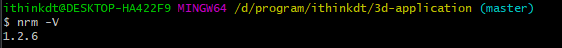
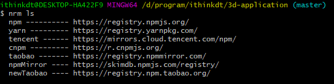
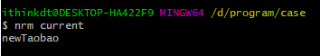
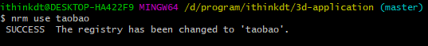
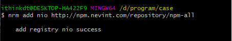
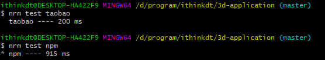

# npm 源管理器 nrm

## 安装

- nrm —— npm resource manager (npm 源管理器)

```js
// 全局安装
npm install nrm -g
```

## nrm 的指令

```js
nrm - V // 看nrm 安装的版本
nrm ls  // 查看可选源 星号代表当前使用源
nrm current  // 查看当前源
nrm use <registry>   // 切换源
nrm add <registry> <url>  // 添加源
nrm del <registry>  // 删除源
nrm test <registry>  // 测试源速度
```

## 使用案例

- 查看版本
  

- 查看源列表
  

- 查看当前源
  

- 切换源
  

- 添加源
  

- 删除源
  

- 测试源速度
  

## 目前 nrm 存在一定的问题，还未修复， 需要处理，可以参考一下地址

[解决安装不能正常使用的问题](https://blog.csdn.net/SiegelionLang/article/details/130081632)
