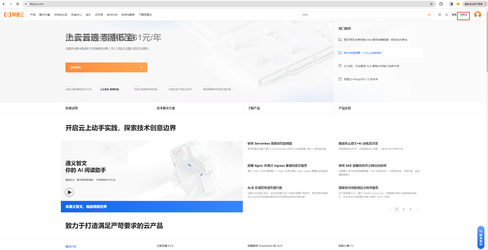
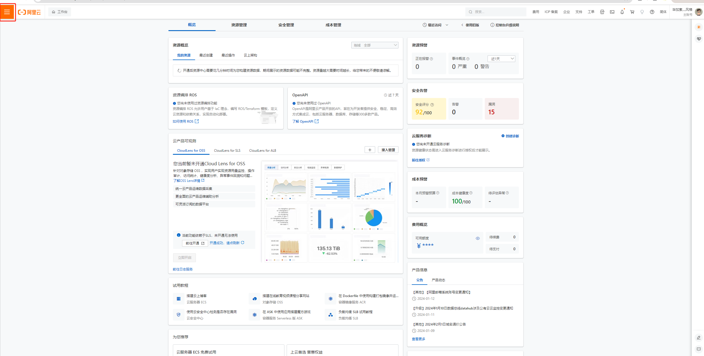
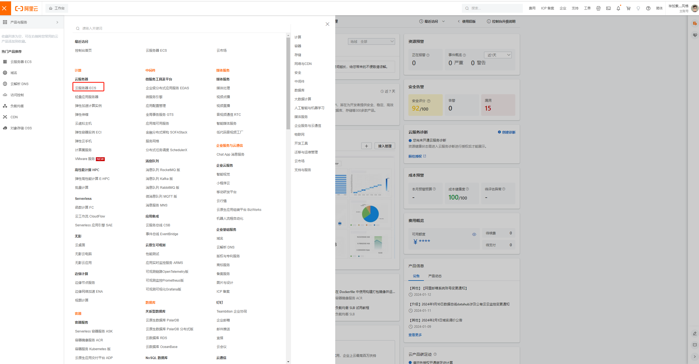
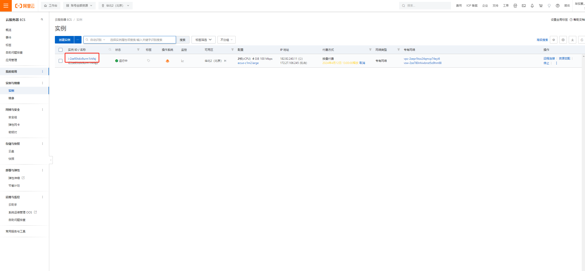
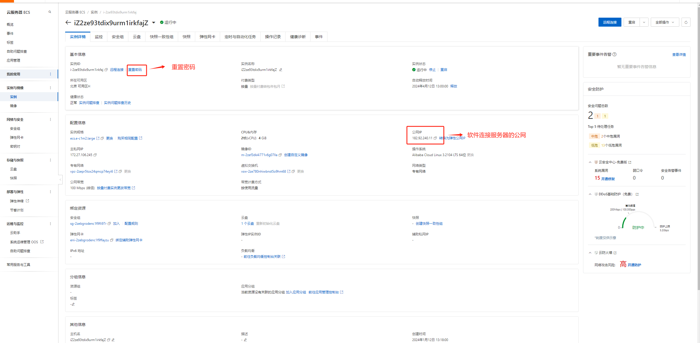
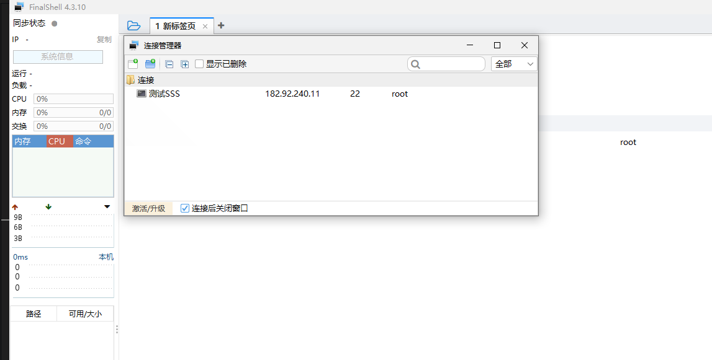
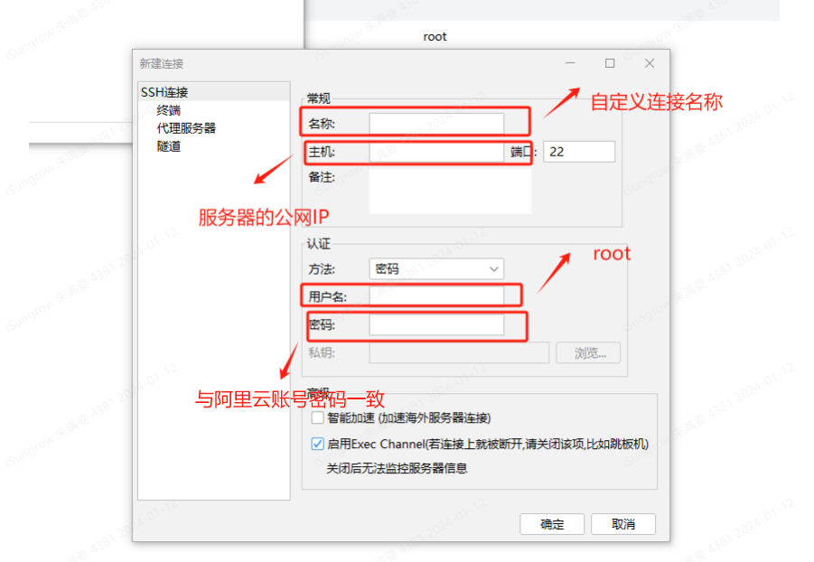

<!--
 * @Date: 2024-01-12 18:09:53
 * @LastEditors: zhumanyao
 * @LastEditTime: 2024-01-12 19:07:14
 * @FilePath: \ocean-of-knowledge\docs\knowledge-module\serve\cloud\index.md
-->

# 阿里云服务器的连接使用

## 阿里云云服务器的操作

## xShell 与 finallShell 连接服务器

- 下载 finallshell

[下载地址](http://www.hostbuf.com/downloads/finalshell_windows_x64.exe)

- 连接服务器操作

  1.右键， 选择 ‘新建’， 在选择 ‘ssh 连接’
  

  2.输入必要的信息
  
