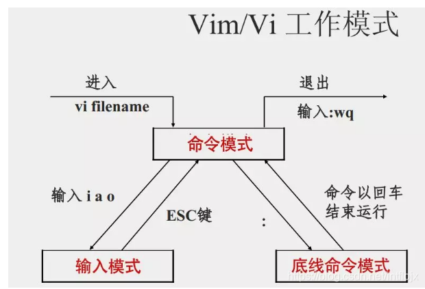
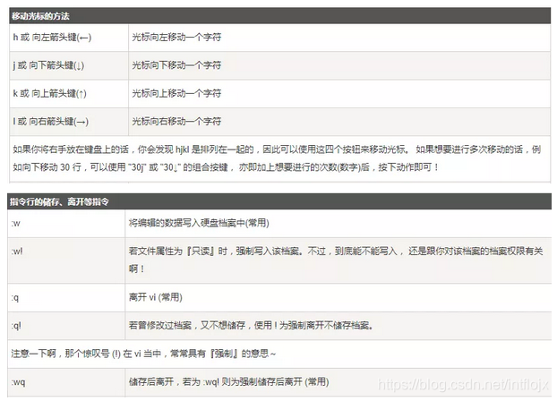
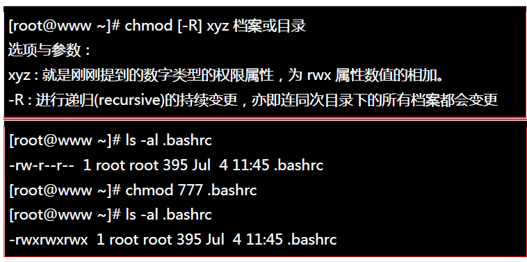
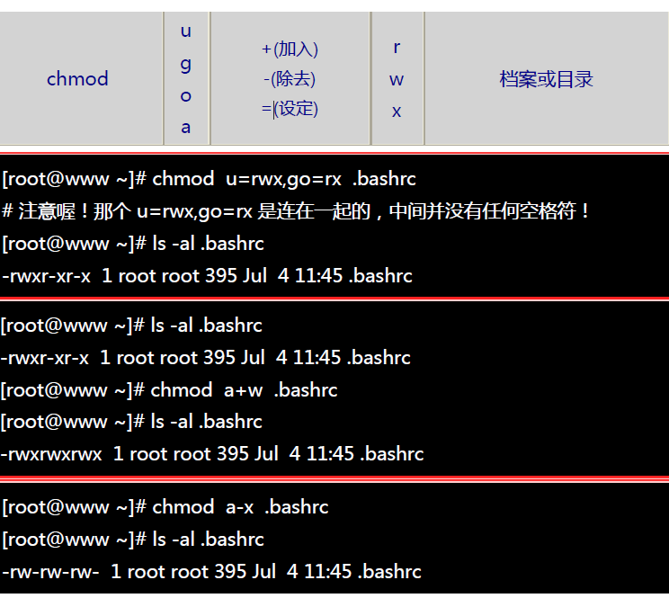

<!--
 * @Date: 2024-01-17 13:36:25
 * @LastEditors: zhumanyao
 * @LastEditTime: 2024-01-24 15:31:11
 * @FilePath: \ocean-of-knowledge\docs\knowledge-module\serve\util\linux.md
-->

# Linux 操作指令集合

## 基本操作命令

- Tab 按钮 —— 命令补全功能
- Ctrl + c 键 —— 停掉正在运行的程序
- Ctrl + d 键 —— 相当于 exit, 退出
- Ctrl + l 键 —— 清屏

## 关机与重启

##### 1. 关机命令： shutdown

在 linux 领域内大多用在服务器上，很少遇到关机的操作。毕竟服务器上跑一个服务是永无止境的，除非特殊情况下，不得已才会关机。

正确的关机流程为：sync > shutdown > reboot > halt

`sync 将数据由内存同步到硬盘中。`

shutdown 关机指令，你可以 man shutdown 来看一下帮助文档。例如你可以运行如下命令关机：

```js
shutdown –h 10 这个命令告诉大家，‘This server will shutdown after 10 mins’,(计算机将在10分钟后关机，并且会显示在登陆用户的当前屏幕中）。

shutdown –h now 立马关机

shutdown –h 20:25 系统会在今天20:25关机

shutdown –h +10 十分钟后关机

shutdown –r now 系统立马重启

shutdown –r +10 系统十分钟后重启

reboot 就是重启，等同于 shutdown –r now

halt 关闭系统，等同于shutdown –h now 和 poweroff
```

##### 取消定时关机命令：shutdown -c

`最后总结一下，不管是重启系统还是关闭系统，首先要运行 sync 命令，把内存中的数据写到磁盘中。`

`关机的命令有 shutdown –h now halt poweroff 和 init 0 , 重启系统的命令有 shutdown –r now reboot init 6`

##### 2. 重启命令：reboot

## 帮助命令

–help 命令

```js
shutdown --help：

ifconfig --help：查看网卡信息
```

man 命令（命令说明书）

```js
man shutdown
```

`注意：man shutdown打开命令说明书之后，使用按键q退出`

## 目录操作命令

- 绝对路径:

`路径的写法，由根目录 / 写起，例如： /usr/share/doc 这个目录`

- 相对路径：

`路径的写法，不是由 / 写起，例如由 /usr/share/doc 要到 /usr/share/man 底下时，可以写成： cd …/man 这就是相对路径的写法啦！`

## 目录切换

命令: cd 目录

cd 是 Change Directory 的缩写，这是用来变换工作目录的命令。

```js
cd /        切换到根目录
cd /usr        切换到根目录下的usr目录
cd ../        切换到上一级目录 或者  cd ..
cd ~        切换到home目录
cd -        切换到上次访问的目录
```

## 查看目录

命令：ls [-al]

语法：

```js
ls [-aAdfFhilnrRSt] 目录名称
ls [--color={never,auto,always}] 目录名称
ls [--full-time] 目录名称
```

```js
ls 查看当前目录下的所有目录和文件
ls -a 查看当前目录下的所有目录和文件（包括隐藏的文件）
ls -l 或 ll 列表查看当前目录下的所有目录和文件（列表查看，显示更多信息）
ls /dir 查看指定目录下的所有目录和文件 如：ls /usr
ls -al ~  将家目录下的所有文件列出来(含属性与隐藏档)
```

## 目录操作【增，删，改，查】

### 创建目录【增】 mkdir

语法：

```js
mkdir [-mp] 目录名称
```

选项与参数：

```js
-m ：配置文件的权限喔！直接配置，不需要看默认权限 (umask) 的脸色～
-p ：帮助你直接将所需要的目录(包含上一级目录)递归创建起来！
```

实例：请到/tmp 底下尝试创建数个新目录看看

```js
cd /tmp
[root@www tmp] mkdir test    <==创建一名为 test 的新目录
[root@www tmp] mkdir test1/test2/test3/test4
mkdir: cannot create directory 'test1/test2/test3/test4':
No such file or directory       <== 没办法直接创建此目录啊！
[root@www tmp] mkdir -p test1/test2/test3/test4   加了这个 -p 的选项，可以自行帮你创建多层目录！
```

实例：创建权限为 rwx–x--x 的目录。

```js
[root@www tmp] mkdir -m 711 test2
[root@www tmp] ls -l
drwxr-xr-x  3 root  root 4096 Jul 18 12:50 test
drwxr-xr-x  3 root  root 4096 Jul 18 12:53 test1
drwx--x--x  2 root  root 4096 Jul 18 12:54 test2
```

上面的权限部分，如果没有加上 -m 来强制配置属性，系统会使用默认属性。

如果我们使用 -m ，如上例我们给予 -m 711 来给予新的目录 drwx–x--x 的权限。

### 删除目录或文件【删】rm

语法：

```js
rm [-fir] 文件或目录
```

选项与参数：

```js
-f ：就是 force 的意思，忽略不存在的文件，不会出现警告信息；
-i ：互动模式，在删除前会询问使用者是否动作
-r ：递归删除啊！最常用在目录的删除了！这是非常危险的选项！！！
```

###### 删除文件：

```js
rm 文件 删除当前目录下的文件
rm -f 文件 删除当前目录的的文件（不询问）
```

###### 删除目录：

```js
rm -r aaa 递归删除当前目录下的aaa目录
rm -rf aaa 递归删除当前目录下的aaa目录（不询问）
```

###### 全部删除：

```js
rm -rf * 将当前目录下的所有目录和文件全部删除
rm -rf /*
**【自杀命令！慎用！慎用！慎用！】**将根目录下的所有文件全部删除
```

注意：rm 不仅可以删除目录，也可以删除其他文件或压缩包，为了方便大家的记忆，无论删除任何目录或文件，都直接使用 rm -rf 目录/文件/压缩包

##### rmdir (删除空的目录)

语法：

```js
rmdir [-p] 目录名称
```

选项与参数：

```js
**-p ：**连同上一级『空的』目录也一起删除
```

实例：

```js
[root@www tmp] rmdir runoob/  删除 runoob 目录
```

### 目录修改【改】mv 和 cp

###### mv (移动文件与目录，或修改名称)

语法：

```js
[root@www ~] mv [-fiu] source destination
[root@www ~] mv [options] source1 source2 source3 .... directory
```

选项与参数：

```js
-f ：force 强制的意思，如果目标文件已经存在，不会询问而直接覆盖；
-i ：若目标文件 (destination) 已经存在时，就会询问是否覆盖！
-u ：若目标文件已经存在，且 source 比较新，才会升级 (update)
```

###### cp (复制文件或目录)

语法:

```js
[root@www ~] cp [-adfilprsu] 来源档(source) 目标档(destination)
[root@www ~] cp [options] source1 source2 source3 .... directory
```

选项与参数：

```js
-a：相当於 -pdr 的意思，至於 pdr 请参考下列说明；(常用)
-d：若来源档为连结档的属性(link file)，则复制连结档属性而非文件本身；
-f：为强制(force)的意思，若目标文件已经存在且无法开启，则移除后再尝试一次；
-i：若目标档(destination)已经存在时，在覆盖时会先询问动作的进行(常用)
-l：进行硬式连结(hard link)的连结档创建，而非复制文件本身；
-p：连同文件的属性一起复制过去，而非使用默认属性(备份常用)；
-r：递归持续复制，用於目录的复制行为；(常用)
-s：复制成为符号连结档 (symbolic link)，亦即『捷径』文件；
-u：若 destination 比 source 旧才升级 destination ！
```

###### 一、重命名目录

命令：mv 当前目录 新目录

例如：mv aaa bbb 将目录 aaa 改为 bbb

注意：mv 的语法不仅可以对目录进行重命名而且也可以对各种文件，压缩包等进行 重命名的操作

###### 二、剪切目录

命令：mv 目录名称 目录的新位置

示例：将/usr/tmp 目录下的 aaa 目录剪切到 /usr 目录下面 mv /usr/tmp/aaa /usr

注意：mv 语法不仅可以对目录进行剪切操作，对文件和压缩包等都可执行剪切操作

###### 三、拷贝目录

命令：cp -r 目录名称 目录拷贝的目标位置 -r 代表递归

示例：将/usr/tmp 目录下的 aaa 目录复制到 /usr 目录下面 cp /usr/tmp/aaa /usr

注意：cp 命令不仅可以拷贝目录还可以拷贝文件，压缩包等，拷贝文件和压缩包时不 用写-r 递归

### 搜索目录【查】find

Linux find 命令用来在指定目录下查找文件。任何位于参数之前的字符串都将被视为欲查找的目录名。如果使用该命令时，不设置任何参数，则 find 命令将在当前目录下查找子目录与文件。并且将查找到的子目录和文件全部进行显示。

语法：

```js
find   path   -option   [   -print ]   [ -exec   -ok   command ]   {} \;   find 目录 参数 文件名称
```

###### 部分参数：

find 根据下列规则判断 path 和 expression，在命令列上第一个 - ( ) , ! 之前的部份为 path，之后的是 expression。如果 path 是空字串则使用目前路径，如果 expression 是空字串则使用 -print 为预设 expression。

expression 中可使用的选项有二三十个之多，在此只介绍最常用的部份。

```js
-mount, -xdev : 只检查和指定目录在同一个文件系统下的文件，避免列出其它文件系统中的文件

-amin n : 在过去 n 分钟内被读取过

-anewer file : 比文件 file 更晚被读取过的文件

-atime n : 在过去n天内被读取过的文件

-cmin n : 在过去 n 分钟内被修改过

-cnewer file :比文件 file 更新的文件

-ctime n : 在过去n天内被修改过的文件
```

###### 实例

将目前目录及其子目录下所有延伸档名是 c 的文件列出来。

```js
find . -name "*.c"
```

将目前目录其其下子目录中所有一般文件列出

```js
find . -type f
```

将目前目录及其子目录下所有最近 20 天内更新过的文件列出

```js
find . -ctime -20
```

## 当前目录显示 pwd

##### pwd (显示目前所在的目录)

pwd 是 Print Working Directory 的缩写，也就是显示目前所在目录的命令。

```js
[root@www ~] pwd [-P]
```

选项与参数：

```js
-P ：显示出确实的路径，而非使用连结 (link) 路径。
```

实例：单纯显示出目前的工作目录：

```js
[root@www ~] pwd
/root   <== 显示出目录啦～
```

## 文件操作命令

## 文件操作【增，删，改，查】

### 新建文件【增】touch

Linux touch 命令用于修改文件或者目录的时间属性，包括存取时间和更改时间。若文件不存在，系统会建立一个新的文件。

ls -l 可以显示档案的时间记录。

###### 语法

```js
touch [-acfm][-d<日期时间>][-r<参考文件或目录>] [-t<日期时间>][--help][--version][文件或目录…]
```

###### 参数说明：

```js
a 改变档案的读取时间记录。
m 改变档案的修改时间记录。
c 假如目的档案不存在，不会建立新的档案。与 --no-create 的效果一样。
f 不使用，是为了与其他 unix 系统的相容性而保留。
r 使用参考档的时间记录，与 --file 的效果一样。
d 设定时间与日期，可以使用各种不同的格式。
t 设定档案的时间记录，格式与 date 指令相同。
–no-create 不会建立新档案。
–help 列出指令格式。
–version 列出版本讯息。
```

###### 实例

- 使用指令"touch"修改文件"testfile"的时间属性为当前系统时间，输入如下命令：

```js
touch testfile                #修改文件的时间属性
```

- 首先，使用 ls 命令查看 testfile 文件的属性，如下所示：

```js
ls -l testfile                #查看文件的时间属性
#原来文件的修改时间为16:09
-rw-r--r-- 1 hdd hdd 55 2011-08-22 16:09 testfile
```

- 执行指令"touch"修改文件属性以后，并再次查看该文件的时间属性，如下所示：

```js
$ touch testfile                #修改文件时间属性为当前系统时间
$ ls -l testfile                #查看文件的时间属性
#修改后文件的时间属性为当前系统时间
-rw-r--r-- 1 hdd hdd 55 2011-08-22 19:53 testfile
```

- 使用指令"touch"时，如果指定的文件不存在，则将创建一个新的空白文件。例如，在当前目录下，使用该指令创建一个空白文件"file"，输入如下命令：

```js
$ touch file            #创建一个名为“file”的新的空白文件
```

### 删除文件 【删】 rm

###### rm (移除文件或目录)

语法：

```js
rm [-fir] 文件或目录
```

选项与参数：

```js
-f ：就是 force 的意思，忽略不存在的文件，不会出现警告信息；

-i ：互动模式，在删除前会询问使用者是否动作

-r ：递归删除啊！最常用在目录的删除了！这是非常危险的选项！！！
```

将创建的 bashrc 删除掉！

```js
[root@www tmp]# rm -i bashrc   如果加上 -i 的选项就会主动询问喔，避免你删除到错误的档名！
rm: remove regular file `bashrc'? y
```

### 修改文件【改】 vi 或 vim

###### vim 键盘图


###### vi/vim 的使用

基本上 vi/vim 共分为三种模式，分别是命令模式（Command mode），输入模式（Insert mode）和底线命令模式（Last line mode）。 这三种模式的作用分别是：

###### 命令模式：

用户刚刚启动 vi/vim，便进入了命令模式。

此状态下敲击键盘动作会被 Vim 识别为命令，而非输入字符。比如我们此时按下 i，并不会输入一个字符，i 被当作了一个命令。

以下是常用的几个命令：

```js
i 切换到输入模式，以输入字符。
x 删除当前光标所在处的字符。
: 切换到底线命令模式，以在最底一行输入命令。
若想要编辑文本：启动Vim，进入了命令模式，按下i，切换到输入模式。
```

命令模式只有一些最基本的命令，因此仍要依靠底线命令模式输入更多命令。

###### 输入模式

在命令模式下按下 i 就进入了输入模式。

在输入模式中，可以使用以下按键：

```js
字符按键以及Shift组合，输入字符
ENTER，回车键，换行
BACK SPACE，退格键，删除光标前一个字符
DEL，删除键，删除光标后一个字符
方向键，在文本中移动光标
HOME/END，移动光标到行首/行尾
Page Up/Page Down，上/下翻页
Insert，切换光标为输入/替换模式，光标将变成竖线/下划线
ESC，退出输入模式，切换到命令模式
```

###### 底线命令模式

在命令模式下按下:（英文冒号）就进入了底线命令模式。

底线命令模式可以输入单个或多个字符的命令，可用的命令非常多。

在底线命令模式中，基本的命令有（已经省略了冒号）：

```js
q 退出程序
w 保存文件
```

按 ESC 键可随时退出底线命令模式。

简单的说，我们可以将这三个模式想成底下的图标来表示：



###### 打开文件

命令：vi 文件名

示例：打开当前目录下的 aa.txt 文件 vi aa.txt 或者 vim aa.txt

注意：使用 vi 编辑器打开文件后，并不能编辑，因为此时处于命令模式，点击键盘 i/a/o 进入编辑模式。

###### 编辑文件

使用 vi 编辑器打开文件后点击按键：i ，a 或者 o 即可进入编辑模式。

```js
i: 在光标所在字符前开始插入
a: 在光标所在字符后开始插入
o: 在光标所在行的下面另起一新行插入
```



###### 保存文件：

第一步：ESC 进入命令行模式

第二步：: 进入底行模式

第三步：wq 保存并退出编辑

###### 取消编辑：

第一步：ESC 进入命令行模式

第二步：: 进入底行模式

第三步：q! 撤销本次修改并退出编辑

### 文件的查看【查】

Linux 系统中使用以下命令来查看文件的内容：

```js
cat 由第一行开始显示文件内容
tac 从最后一行开始显示，可以看出 tac 是 cat 的倒着写！
nl 显示的时候，顺道输出行号！
more 一页一页的显示文件内容
less 与 more 类似，但是比 more 更好的是，他可以往前翻页！
head 只看头几行
tail 只看尾巴几行
```

你可以使用 *man [命令]*来查看各个命令的使用文档，如 ：man cp。

###### cat

由第一行开始显示文件内容

语法：

```js
cat[-AbEnTv]
```

选项与参数：

```js
-A ：相当於 -vET 的整合选项，可列出一些特殊字符而不是空白而已；
-b ：列出行号，仅针对非空白行做行号显示，空白行不标行号！
-E ：将结尾的断行字节 $ 显示出来；
-n ：列印出行号，连同空白行也会有行号，与 -b 的选项不同；
-T ：将 [tab] 按键以 ^I 显示出来；
-v ：列出一些看不出来的特殊字符
```

实例： 检看 /etc/issue 这个文件的内容：

```js
[root@www ~] cat /etc/issue
CentOS release 6.4 (Final)
Kernel \r on an \m
```

tac 与 cat 命令刚好相反，文件内容从最后一行开始显示，可以看出 tac 是 cat 的倒着写！如：

```js
[root@www ~] tac /etc/issue
Kernel \r on an \m
CentOS release 6.4 (Final)
```

###### nl

显示行号

语法：

```js
nl [-bnw] 文件
```

选项与参数：

```js
-b ：指定行号指定的方式，主要有两种：
-b a ：表示不论是否为空行，也同样列出行号(类似 cat -n)；
-b t ：如果有空行，空的那一行不要列出行号(默认值)；
-n ：列出行号表示的方法，主要有三种：
-n ln ：行号在荧幕的最左方显示；
-n rn ：行号在自己栏位的最右方显示，且不加 0 ；
-n rz ：行号在自己栏位的最右方显示，且加 0 ；
-w ：行号栏位的占用的位数。
```

实例一：用 nl 列出 /etc/issue 的内容

```js
[root@www ~] nl /etc/issue
     1  CentOS release 6.4 (Final)
     2  Kernel \r on an \m
```

###### more

一页一页翻动

```js
[root@www ~] more /etc/man_db.config
#
# Generated automatically from man.conf.in by the
# configure script.
#
# man.conf from man-1.6d
....(中间省略)....
--More--(28%)  <== 重点在这一行喔！你的光标也会在这里等待你的命令
```

在 more 这个程序的运行过程中，你有几个按键可以按的：

```js
空白键 (space)：代表向下翻一页；
Enter ：代表向下翻『一行』；
/字串 ：代表在这个显示的内容当中，向下搜寻『字串』这个关键字；
:f ：立刻显示出档名以及目前显示的行数；
q ：代表立刻离开 more ，不再显示该文件内容。
b 或 [ctrl]-b ：代表往回翻页，不过这动作只对文件有用，对管线无用。
```

###### less

一页一页翻动，以下实例输出/etc/man.config 文件的内容：

```js
[root@www ~] less /etc/man.config
#
# Generated automatically from man.conf.in by the
# configure script.
#
# man.conf from man-1.6d
....(中间省略)....
:   <== 这里可以等待你输入命令！
```

less 运行时可以输入的命令有：

```js
空白键 ：向下翻动一页；
[pagedown]：向下翻动一页；
[pageup] ：向上翻动一页；
/字串 ：向下搜寻『字串』的功能；
?字串 ：向上搜寻『字串』的功能；
n ：重复前一个搜寻 (与 / 或 ? 有关！)
N ：反向的重复前一个搜寻 (与 / 或 ? 有关！)
q ：离开 less 这个程序；
```

###### head

取出文件前面几行

语法：

```js
head [-n number] 文件
```

选项与参数：

```js
-n ：后面接数字，代表显示几行的意思
```

实例： 默认的情况中，显示前面 10 行！若要显示前 20 行，就得要这样：

```js
[root@www ~] head -n 20 /etc/man.config
```

###### tail

取出文件后面几行

语法：

```js
tail [-n number] 文件
```

选项与参数：

```js
-n ：后面接数字，代表显示几行的意思
-f ：表示持续侦测后面所接的档名，要等到按下[ctrl]-c才会结束tail的侦测
```

实例：

```js
[root@www ~] tail /etc/man.config
# 默认的情况中，显示最后的十行！若要显示最后的 20 行，就得要这样：
[root@www ~] tail -n 20 /etc/man.config
```

## 权限修改

Linux/Unix 的文件调用权限分为三级 : 文件拥有者、群组、其他。利用 chmod 可以藉以控制文件如何被他人所调用。

- 使用权限 : 所有使用者

###### 语法

```js
chmod [-cfvR] [--help] [--version] mode file...
```

#### 参数说明

mode : 权限设定字串，格式如下 :

```js
[ugoa...][[+-=][rwxX]...][,...]
```

```js
u 表示该文件的拥有者，g 表示与该文件的拥有者属于同一个群体(group)者，o 表示其他以外的人，a 表示这三者皆是。
+ 表示增加权限、- 表示取消权限、= 表示唯一设定权限。
r 表示可读取，w 表示可写入，x 表示可执行，X 表示只有当该文件是个子目录或者该文件已经被设定过为可执行。
```

```js
-c : 若该文件权限确实已经更改，才显示其更改动作
-f : 若该文件权限无法被更改也不要显示错误讯息
-v : 显示权限变更的详细资料
-R : 对目前目录下的所有文件与子目录进行相同的权限变更(即以递回的方式逐个变更)
–help : 显示辅助说明
–version : 显示版本
```

权限的设定方法有两种， 分别可以使用数字或者是符号来进行权限的变更。

###### 数字类型改变档案权限：



###### 符号类型改变档案权限



## 压缩文件操作

Linux 常用的压缩与解压缩命令有：tar、gzip、gunzip、bzip2、bunzip2、compress 、uncompress、 zip、 unzip、rar、unrar 等。

## 打包和压缩和解压

Windows 的压缩文件的扩展名 .zip/.rar

linux 中的打包文件：aa.tar

linux 中的压缩文件：bb.gz

linux 中打包并压缩的文件：.tar.gz

Linux 中的打包文件一般是以.tar 结尾的，压缩的命令一般是以.gz 结尾的。

而一般情况下打包和压缩是一起进行的，打包并压缩后的文件的后缀名一般.tar.gz。

###### tar

最常用的打包命令是 tar，使用 tar 程序打出来的包我们常称为 tar 包，tar 包文件的命令通常都是以 .tar 结尾的。生成 tar 包后，就可以用其它的程序来进行压缩了，所以首先就来讲讲 tar 命令的基本用法。

tar 命令的选项有很多(用 man tar 可以查看到)，但常用的就那么几个选项，下面来举例说明一下：

```js
tar -cf all.tar *.jpg
```

这条命令是将所有 .jpg 的文件打成一个名为 all.tar 的包。-c 是表示产生新的包，-f 指定包的文件名。

```js
tar -rf all.tar *.gif
```

这条命令是将所有 .gif 的文件增加到 all.tar 的包里面去，-r 是表示增加文件的意思。

```js
tar -uf all.tar logo.gif
```

这条命令是更新原来 tar 包 all.tar 中 logo.gif 文件，-u 是表示更新文件的意思。

```js
tar -tf all.tar
```

这条命令是列出 all.tar 包中所有文件，-t 是列出文件的意思。

```js
tar -xf all.tar
```

这条命令是解出 all.tar 包中所有文件，-x 是解开的意思。

以上就是 tar 的最基本的用法。为了方便用户在打包解包的同时可以压缩或解压文件，tar 提供了一种特殊的功能。这就是 tar 可以在打包或解包的同时调用其它的压缩程序，比如调用 gzip、bzip2 等。

1. tar 调用 gzip

gzip 是 GNU 组织开发的一个压缩程序，.gz 结尾的文件就是 gzip 压缩的结果。与 gzip 相对的解压程序是 gunzip。tar 中使用 -z 这个参数来调用 gzip。下面来举例说明一下：

```js
tar -czf all.tar.gz *.jpg
```

这条命令是将所有 .jpg 的文件打成一个 tar 包，并且将其用 gzip 压缩，生成一个 gzip 压缩过的包，包名为 all.tar.gz。

```js
tar -xzf all.tar.gz
```

这条命令是将上面产生的包解开。

2. tar 调用 bzip2

bzip2 是一个压缩能力更强的压缩程序，.bz2 结尾的文件就是 bzip2 压缩的结果。

与 bzip2 相对的解压程序是 bunzip2。tar 中使用 -j 这个参数来调用 gzip。下面来举例说明一下：

```js
tar -cjf all.tar.bz2 *.jpg
```

这条命令是将所有 .jpg 的文件打成一个 tar 包，并且将其用 bzip2 压缩，生成一个 bzip2 压缩过的包，包名为 all.tar.bz2

```js
tar -xjf all.tar.bz2
```

这条命令是将上面产生的包解开。

3. tar 调用 compress

compress 也是一个压缩程序，但是好象使用 compress 的人不如 gzip 和 bzip2 的人多。.Z 结尾的文件就是 bzip2 压缩的结果。与 compress 相对的解压程序是 uncompress。tar 中使用 -Z 这个参数来调用 compress。下面来举例说明一下：

```js
tar -cZf all.tar.Z *.jpg
```

这条命令是将所有 .jpg 的文件打成一个 tar 包，并且将其用 compress 压缩，生成一个 uncompress 压缩过的包，包名为 all.tar.Z。

```js
 tar -xZf all.tar.Z
```

这条命令是将上面产生的包解开。

有了上面的知识，你应该可以解开多种压缩文件了，下面对于 tar 系列的压缩文件作一个小结：

1. 对于.tar 结尾的文件

```js
tar -xf all.tar
```

2. 对于 .gz 结尾的文件

```js
gzip -d all.gz
gunzip all.gz
```

3. 对于 .tgz 或 .tar.gz 结尾的文件

```js
tar -xzf all.tar.gz
tar -xzf all.tgz
```

4.  对于 .bz2 结尾的文件

```js
bzip2 -d all.bz2
bunzip2 all.bz2
```

5. 对于 tar.bz2 结尾的文件

```js
tar -xjf all.tar.bz2
```

6. 对于 .Z 结尾的文件

```js
uncompress all.Z
```

7. 对于 .tar.Z 结尾的文件

```js
tar -xZf all.tar.z
```

###### 另外对于 Windows 下的常见压缩文件 .zip 和 .rar，Linux 也有相应的方法来解压它们：

1. 对于 .zip

linux 下提供了 zip 和 unzip 程序，zip 是压缩程序，unzip 是解压程序。它们的参数选项很多，这里只做简单介绍，依旧举例说明一下其用法：

zip all.zip \*.jpg

这条命令是将所有 .jpg 的文件压缩成一个 zip 包:

unzip all.zip

这条命令是将 all.zip 中的所有文件解压出来。

2. 对于 .rar

要在 linux 下处理 .rar 文件，需要安装 RAR for Linux。下载地址：http://www.rarsoft.com/download.htm，下载后安装即可。

```js
tar -xzpvf rarlinux-x64-5.6.b5.tar.gz
cd rar
make
```

这样就安装好了，安装后就有了 rar 和 unrar 这两个程序，rar 是压缩程序，unrar 是解压程序。它们的参数选项很多，这里只做简单介绍，依旧举例说明一下其用法：

rar a all \*.jpg

这条命令是将所有 .jpg 的文件压缩成一个 rar 包，名为 all.rar，该程序会将 .rar 扩展名将自动附加到包名后。

unrar e all.rar

这条命令是将 all.rar 中的所有文件解压出来

## 扩展内容

###### tar

```js
-c: 建立压缩档案
-x：解压
-t：查看内容 shell
-r：向压缩归档文件末尾追加文件
-u：更新原压缩包中的文件
```

这五个是独立的命令，压缩解压都要用到其中一个，可以和别的命令连用但只能用其中一个。下面的参数是根据需要在压缩或解压档案时可选的。

```js
-z：有gzip属性的
-j：有bz2属性的
-Z：有compress属性的
-v：显示所有过程
-O：将文件解开到标准输出
```

下面的参数 -f 是必须的:

```js
-f: 使用档案名字，切记，这个参数是最后一个参数，后面只能接档案名。
```

` # tar -cf all.tar *.jpg`

这条命令是将所有 .jpg 的文件打成一个名为 all.tar 的包。-c 是表示产生新的包，-f 指定包的文件名。

tar -rf all.tar \*.gif

这条命令是将所有 .gif 的文件增加到 all.tar 的包里面去。-r 是表示增加文件的意思。

tar -uf all.tar logo.gif

这条命令是更新原来 tar 包 all.tar 中 logo.gif 文件，-u 是表示更新文件的意思。

tar -tf all.tar

这条命令是列出 all.tar 包中所有文件，-t 是列出文件的意思。

tar -xf all.tar

这条命令是解出 all.tar 包中所有文件，-x 是解开的意思。

###### 压缩

```js
tar –cvf jpg.tar *.jpg       // 将目录里所有jpg文件打包成 tar.jpg
tar –czf jpg.tar.gz *.jpg    // 将目录里所有jpg文件打包成 jpg.tar 后，并且将其用 gzip 压缩，生成一个 gzip 压缩过的包，命名为 jpg.tar.gz
tar –cjf jpg.tar.bz2 *.jpg   // 将目录里所有jpg文件打包成 jpg.tar 后，并且将其用 bzip2 压缩，生成一个 bzip2 压缩过的包，命名为jpg.tar.bz2
tar –cZf jpg.tar.Z *.jpg     // 将目录里所有 jpg 文件打包成 jpg.tar 后，并且将其用 compress 压缩，生成一个 umcompress 压缩过的包，命名为jpg.tar.Z
rar a jpg.rar *.jpg          // rar格式的压缩，需要先下载 rar for linux
zip jpg.zip *.jpg            // zip格式的压缩，需要先下载 zip for linux
```

###### 解压

```js
tar –xvf file.tar         // 解压 tar 包
tar -xzvf file.tar.gz     // 解压 tar.gz
tar -xjvf file.tar.bz2    // 解压 tar.bz2
tar –xZvf file.tar.Z      // 解压 tar.Z
unrar e file.rar          // 解压 rar
unzip file.zip            // 解压 zip
```

###### 总结

```js
1、.tar 用 tar –xvf 解压
2、.gz 用 gzip -d或者gunzip 解压
3、.tar.gz和.tgz 用 tar –xzf 解压
4、.bz2 用 bzip2 -d或者用bunzip2 解压
5、.tar.bz2用tar –xjf 解压
6、.Z 用 uncompress 解压
7、.tar.Z 用tar –xZf 解压
8、.rar 用 unrar e解压
9、.zip 用 unzip 解压
```

## 查找命令

### grep

##### grep 命令是一种强大的文本搜索工具

使用实例：

```js
ps -ef | grep sshd 查找指定ssh服务进程
ps -ef | grep sshd | grep -v grep 查找指定服务进程，排除gerp身
ps -ef | grep sshd -c 查找指定进程个数
```

从文件内容查找匹配指定字符串的行：

`$ grep “被查找的字符串” 文件名`

例子：在当前目录里第一级文件夹中寻找包含指定字符串的 .in 文件

`grep “thermcontact” /.in`

从文件内容查找与正则表达式匹配的行：

`$ grep –e “正则表达式” 文件名`

查找时不区分大小写：

`$ grep –i “被查找的字符串” 文件名`

查找匹配的行数：

`$ grep -c “被查找的字符串” 文件名`

从文件内容查找不匹配指定字符串的行：

`$ grep –v “被查找的字符串” 文件名`

### find

find 命令在目录结构中搜索文件，并对搜索结果执行指定的操作。

find 默认搜索当前目录及其子目录，并且不过滤任何结果（也就是返回所有文件），将它们全都显示在屏幕上。

使用实例：

```js
find . -name "*.log" -ls  在当前目录查找以.log结尾的文件，并显示详细信息。
find /root/ -perm 600   查找/root/目录下权限为600的文件
find . -type f -name "*.log"  查找当目录，以.log结尾的普通文件
find . -type d | sort   查找当前所有目录并排序
find . -size +100M  查找当前目录大于100M的文件
```

从根目录开始查找所有扩展名为 .log 的文本文件，并找出包含 “ERROR” 的行：

`$ find / -type f -name “*.log” | xargs grep “ERROR”`

例子：从当前目录开始查找所有扩展名为 .in 的文本文件，并找出包含 “thermcontact” 的行：

`find . -name “*.in” | xargs grep “thermcontact”`

### locate

locate 让使用者可以很快速的搜寻某个路径。默认每天自动更新一次，所以使用 locate 命令查不到最新变动过的文件。为了避免这种情况，可以在使用 locate 之前，先使用 updatedb 命令，手动更新数据库。如果数据库中没有查询的数据，则会报出 locate: can not stat () `/var/lib/mlocate/mlocate.db’: No such file or directory 该错误！updatedb 即可！

yum -y install mlocate 如果是精简版 CentOS 系统需要安装 locate 命令

使用实例

```js
updatedb
locate /etc/sh 搜索etc目录下所有以sh开头的文件
locate pwd 查找和pwd相关的所有文件
```

### whereis

whereis 命令是定位可执行文件、源代码文件、帮助文件在文件系统中的位置。这些文件的属性应属于原始代码，二进制文件，或是帮助文件。

使用实例：

whereis ls 将和 ls 文件相关的文件都查找出来

### which

which 命令的作用是在 PATH 变量指定的路径中，搜索某个系统命令的位置，并且返回第一个搜索结果。

使用实例：

```js
which pwd 查找pwd命令所在路径
which java 查找path中java的路径
```

## su、sudo

### su

Linux su 命令用于变更为其他使用者的身份，除 root 外，需要键入该使用者的密码。

使用权限：所有使用者。

语法:

```js
su [-fmp] [-c command] [-s shell] [–help] [–version] [-] [USER [ARG]]
```

参数说明：

```js
-f 或 --fast 不必读启动档（如 csh.cshrc 等），仅用于 csh 或 tcsh
-m -p 或 --preserve-environment 执行 su 时不改变环境变数
-c command 或 --command=command 变更为帐号为 USER 的使用者并执行指令（command）后再变回原来使用者
-s shell 或 --shell=shell 指定要执行的 shell （bash csh tcsh 等），预设值为 /etc/passwd 内的该使用者（USER） shell
–help 显示说明文件
–version 显示版本资讯

-l 或 --login 这个参数加了之后，就好像是重新 login 为该使用者一样，大部份环境变数（HOME SHELL USER等等）都是以该使用者（USER）为主，并且工作目录也会改变，如果没有指定 USER ，内定是 root
USER 欲变更的使用者帐号
ARG 传入新的 shell 参数
```

实例

变更帐号为 root 并在执行 ls 指令后退出变回原使用者

```js
su -c ls root
```

变更帐号为 root 并传入 -f 参数给新执行的 shell

```js
su root -f
```

变更帐号为 clsung 并改变工作目录至 clsung 的家目录（home dir）

```js
su - clsung
```

切换用户

```js
hnlinux@runoob.com:~$ whoami //显示当前用户
hnlinux
hnlinux@runoob.com:~$ pwd //显示当前目录
/home/hnlinux
hnlinux@runoob.com:~$ su root //切换到root用户
密码：
root@runoob.com:/home/hnlinux# whoami
root
root@runoob.com:/home/hnlinux# pwd
/home/hnlinux
```

切换用户，改变环境变量

```js
hnlinux@runoob.com:~$ whoami //显示当前用户
hnlinux
hnlinux@runoob.com:~$ pwd //显示当前目录
/home/hnlinux
hnlinux@runoob.com:~$ su - root //切换到root用户
密码：
root@runoob.com:/home/hnlinux# whoami
root
root@runoob.com:/home/hnlinux# pwd //显示当前目录
/root
```

su 用于用户之间的切换。但是切换前的用户依然保持登录状态。如果是 root 向普通或虚拟用户切换不需要密码，反之普通用户切换到其它任何用户都需要密码验证。

```js
su test:切换到test用户，但是路径还是/root目录
su - test : 切换到test用户，路径变成了/home/test
su : 切换到root用户，但是路径还是原来的路径
su - : 切换到root用户，并且路径是/root
su不足：如果某个用户需要使用root权限、则必须要把root密码告诉此用户。
```

退出返回之前的用户：exit

### sudo

sudo 是为所有想使用 root 权限的普通用户设计的。可以让普通用户具有临时使用 root 权限的权利。只需输入自己账户的密码即可。

进入 sudo 配置文件命令：

```js
vi / etc / sudoer或者visudo
```

案例：

允许 hadoop 用户以 root 身份执行各种应用命令，需要输入 hadoop 用户的密码。

hadoop ALL=(ALL) ALL

案例：

只允许 hadoop 用户以 root 身份执行 ls 、cat 命令，并且执行时候免输入密码。

配置文件中：

hadoop ALL=NOPASSWD: /bin/ls, /bin/cat

```js
su root -f
```

变更帐号为 clsung 并改变工作目录至 clsung 的家目录（home dir）

```js
su - clsung
```

切换用户

```js
hnlinux@runoob.com:~$ whoami //显示当前用户
hnlinux
hnlinux@runoob.com:~$ pwd //显示当前目录
/home/hnlinux
hnlinux@runoob.com:~$ su root //切换到root用户
密码：
root@runoob.com:/home/hnlinux# whoami
root
root@runoob.com:/home/hnlinux# pwd
/home/hnlinux
```

切换用户，改变环境变量

```js
hnlinux@runoob.com:~$ whoami //显示当前用户
hnlinux
hnlinux@runoob.com:~$ pwd //显示当前目录
/home/hnlinux
hnlinux@runoob.com:~$ su - root //切换到root用户
密码：
root@runoob.com:/home/hnlinux# whoami
root
root@runoob.com:/home/hnlinux# pwd //显示当前目录
/root
```

su 用于用户之间的切换。但是切换前的用户依然保持登录状态。如果是 root 向普通或虚拟用户切换不需要密码，反之普通用户切换到其它任何用户都需要密码验证。

```js
su test:切换到test用户，但是路径还是/root目录
su - test : 切换到test用户，路径变成了/home/test
su : 切换到root用户，但是路径还是原来的路径
su - : 切换到root用户，并且路径是/root
su不足：如果某个用户需要使用root权限、则必须要把root密码告诉此用户。
```

退出返回之前的用户：exit

## 下载与安装 yum

yum（ Yellow dog Updater, Modified）是一个在 Fedora 和 RedHat 以及 SUSE 中的 Shell 前端软件包管理器。

基於 RPM 包管理，能够从指定的服务器自动下载 RPM 包并且安装，可以自动处理依赖性关系，并且一次安装所有依赖的软体包，无须繁琐地一次次下载、安装。

yum 提供了查找、安装、删除某一个、一组甚至全部软件包的命令，而且命令简洁而又好记。

### yum 语法

```js
yum [options] [command] [package ...]
```

```js
**options：**可选，选项包括-h（帮助），-y（当安装过程提示选择全部为"yes"），-q（不显示安装的过程）等等。
**command：**要进行的操作。
package操作的对象。
```

### yum 常用命令

```js
1.列出所有可更新的软件清单命令：yum check-update
2.更新所有软件命令：yum update
3.仅安装指定的软件命令：yum install <package_name>
4.仅更新指定的软件命令：yum update <package_name>
5.列出所有可安裝的软件清单命令：yum list
6.删除软件包命令：yum remove <package_name>
7.查找软件包 命令：yum search
8.清除缓存命令:
  yum clean packages: 清除缓存目录下的软件包
  yum clean headers: 清除缓存目录下的 headers
  yum clean oldheaders: 清除缓存目录下旧的 headers
  yum clean, yum clean all (= yum clean packages; yum clean oldheaders) :清除缓存目录下的软件包及旧的headers
```

### 实例 1

- 安装 pam-devel

```js
[root@www ~] yum install pam-devel
Setting up Install Process
Parsing package install arguments
Resolving Dependencies  <==先检查软件的属性相依问题
--> Running transaction check
---> Package pam-devel.i386 0:0.99.6.2-4.el5 set to be updated
--> Processing Dependency: pam = 0.99.6.2-4.el5 for package: pam-devel
--> Running transaction check
---> Package pam.i386 0:0.99.6.2-4.el5 set to be updated
filelists.xml.gz          100% |=========================| 1.6 MB    00:05
filelists.xml.gz          100% |=========================| 138 kB    00:00
-> Finished Dependency Resolution
……(省略)
```

### 实例 2

- 移除 pam-devel

```js
[root@www ~] yum remove pam-devel
Setting up Remove Process
Resolving Dependencies  <==同样的，先解决属性相依的问题
--> Running transaction check
---> Package pam-devel.i386 0:0.99.6.2-4.el5 set to be erased
--> Finished Dependency Resolution

Dependencies Resolved

=============================================================================
 Package                 Arch       Version          Repository        Size
=============================================================================
Removing:
 pam-devel               i386       0.99.6.2-4.el5   installed         495 k

Transaction Summary
=============================================================================
Install      0 Package(s)
Update       0 Package(s)
Remove       1 Package(s)  <==还好，并没有属性相依的问题，单纯移除一个软件

Is this ok [y/N]: y
Downloading Packages:
Running rpm_check_debug
Running Transaction Test
Finished Transaction Test
Transaction Test Succeeded
Running Transaction
  Erasing   : pam-devel                    ######################### [1/1]

Removed: pam-devel.i386 0:0.99.6.2-4.el5
Complete!
```

### 实例 3

- 利用 yum 的功能，找出以 pam 为开头的软件名称有哪些？

```js
[root@www ~] yum list pam*
Installed Packages
pam.i386                  0.99.6.2-3.27.el5      installed
pam_ccreds.i386           3-5                    installed
pam_krb5.i386             2.2.14-1               installed
pam_passwdqc.i386         1.0.2-1.2.2            installed
pam_pkcs11.i386           0.5.3-23               installed
pam_smb.i386              1.1.7-7.2.1            installed
Available Packages <==底下则是『可升级』的或『未安装』的
pam.i386                  0.99.6.2-4.el5         base
pam-devel.i386            0.99.6.2-4.el5         base
pam_krb5.i386             2.2.14-10              base
```

### 国内 yum 源

网易（163）yum 源是国内最好的 yum 源之一 ，无论是速度还是软件版本，都非常的不错。

将 yum 源设置为 163 yum，可以提升软件包安装和更新的速度，同时避免一些常见软件版本无法找到。

- 安装步骤

首先备份/etc/yum.repos.d/CentOS-Base.repo

mv /etc/yum.repos.d/CentOS-Base.repo /etc/yum.repos.d/CentOS-Base.repo.backup

下载对应版本 repo 文件, 放入 /etc/yum.repos.d/ (操作前请做好相应备份)

```js
CentOS5 ：http://mirrors.163.com/.help/CentOS5-Base-163.repo
CentOS6 ：http://mirrors.163.com/.help/CentOS6-Base-163.repo
CentOS7 ：http://mirrors.163.com/.help/CentOS7-Base-163.repo
wget http://mirrors.163.com/.help/CentOS6-Base-163.repo
mv CentOS6-Base-163.repo CentOS-Base.repo
```

运行以下命令生成缓存

```js
yum clean all
yum makecache
```

除了网易之外，国内还有其他不错的 yum 源，比如中科大和搜狐。

中科大的 yum 源，安装方法查看：https://lug.ustc.edu.cn/wiki/mirrors/help/centos

sohu 的 yum 源安装方法查看: http://mirrors.sohu.com/help/centos.htm

### Linux 三剑客（awk，sed，grep）

###### awk、sed、grep 更适合的方向：

```js
grep 更适合单纯的查找或匹配文本
sed 更适合编辑匹配到的文本
awk 更适合格式化文本，对文本进行较复杂格式处理
```

## 剩余的相关命令

[剩余的相关 linux 命令的地址](https://www.cnblogs.com/twcat/p/16912345.html#awk)
