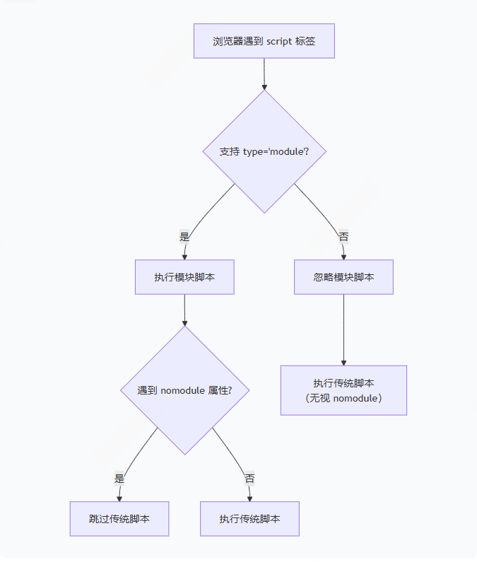

# Script 标签的详解

## 1. 基本语法

- 内联脚本

```html
<script>
  console.log("Hello, World!");
</script>
```

- 外部脚本

```html
<script src="script.js"></script>
```

## 2. 主要属性

### 2.1 src属性 ——  指定外部脚本URL

```html
<script src="https://cdn.example.com/library.js"></script>
<script src="/local/path/script.js"></script>
```

### 2.2 type属性 —— 脚本类型

```html
<!-- 默认值，JavaScript代码 -->
<script type="text/javascript"></script>

<!-- ES6模块 -->
<script type="module"></script>

<!-- 导入映射 -->
<script type="importmap"></script>

<!-- 其他MIME类型 -->
<script type="application/json"></script>
```

### 2.3 async —— 异步加载

```html
<script src="script.js" async></script>
```

- 仅适用于外部脚本
- 下载脚本时不会阻塞HTML解析
- 脚本下载完成后立即执行，可能会中断HTML解析
- 多个async脚本执行顺序不确定

### 2.4 defer —— 延迟执行

```html
<script src="script.js" defer></script>
```

- 仅适用于外部脚本
- 下载脚本时不会阻塞HTML解析
- 脚本在HTML解析完成后、DOMContentLoaded事件前执行
- 多个defer脚本按HTML中的顺序执行

### 2.5 crossorigin —— 跨域设置 （安全地获取跨域脚本的详细错误信息和启用CORS机制，对于依赖第三方库的现代Web应用来说非常重要）


```html
<!-- 匿名跨域请求 -->
<!-- anonymous	默认值, 发起跨域请求时不带凭据（cookies等） -->
<!-- 空值 (crossorigin 或 crossorigin="")	等同于 anonymous -->
<script src="https://cdn.example.com/script.js" crossorigin></script>

<!-- 使用凭证的跨域请求 -->
<!-- use-credentials	发送凭据（cookies、HTTP认证等），服务器需返回 Access-Control-Allow-Credentials: true -->
<script src="https://cdn.example.com/script.js" crossorigin="use-credentials"></script>
```

- 使用 crossorigin 时，服务器必须返回正确的CORS响应头：

```js
Access-Control-Allow-Origin: *
# 或指定域名
Access-Control-Allow-Origin: https://yourdomain.com
```

- 实际应用场景

```bash
错误监控 - 捕获第三方CDN脚本的详细错误

性能监控 - 获取第三方资源的加载性能数据

安全性 - 明确声明跨域资源加载策略

现代模块化 - 配合 type="module" 使用
```

- 注意事项

```bash
资源必须支持CORS - 如果服务器未设置正确的CORS头，脚本可能加载失败

凭据安全 - 除非必要，不要使用 use-credentials

兼容性 - 所有现代浏览器都支持，IE10+部分支持
```

### 2.6 integrity - 子资源完整性 (用于验证获取资源的完整性，防止资源被篡改。)

```html
<script 
  src="https://cdn.example.com/script.js"
  integrity="sha384-oqVuAfXRKap7fdgcCY5uykM6+R9GqQ8K/uxy9rx7HNQlGYl1kPzQho1wx4JwY8wC"
  crossorigin="anonymous">
</script>
```

- 命令生成 integrity 的值

```bash
# 生成 sha384 哈希值
openssl dgst -sha384 -binary my-script.js | openssl base64 -A

# 或使用 shasum
cat my-script.js | openssl dgst -sha384 -binary | base64

# 在线工具（开发时使用）
# https://www.srihash.org/
```

- Node.js 生成

```bash
const crypto = require('crypto');
const fs = require('fs');

const fileBuffer = fs.readFileSync('script.js');
const hash = crypto.createHash('sha384');
const hashBase64 = hash.update(fileBuffer).digest('base64');

console.log(`sha384-${hashBase64}`);
```

### 2.8 referrerpolicy - 引用策略 (用于控制从当前页面跳转或请求资源时，HTTP Referer 头信息的发送策略。对于 script 标签，它控制加载脚本时的引用来源信息。)

```html
<script src="script.js" referrerpolicy="no-referrer"></script>
```

- Referer（注意：HTTP标准中拼写错误，应该是Referrer）是HTTP请求头的一部分，表示请求来源页面的URL。

```bash
GET /script.js HTTP/1.1
Host: cdn.example.com
Referer: https://www.yoursite.com/page.html  # 这个就是referer信息
```

| 策略值                         | 发送的Referer                 | 说明                                 | 安全等级 |
|--------------------------------|-------------------------------|--------------------------------------|----------|
| no-referrer                     | 完全不发送                    | 最严格                               | 🔒🔒🔒    |
| no-referrer-when-downgrade      | 默认值                        | HTTPS→HTTPS发送完整URL                | 🔒🔒      |
| origin                          | 只发送源（协议+域名+端口）     | https://www.site.com/page → https://www.site.com | 🔒🔒      |
| origin-when-cross-origin        | 同源完整，跨域只发源           | 智能策略                             | 🔒🔒      |
| same-origin                     | 同源发送，跨域不发送           | 严格的同源策略                       | 🔒🔒🔒    |
| strict-origin                   | 不降级时发送源                 | HTTPS→HTTPS发送源                     | 🔒🔒🔒    |
| strict-origin-when-cross-origin | 现代默认（推荐）               | 同源完整，跨域智能                    | 🔒🔒      |
| unsafe-url                      | 总是发送完整URL                | 最宽松（潜在风险）                    | 🔒        |

### 2.8 nomodule —— 不支持模块时的后备 (一个向后兼容的布尔属性，用于在现代浏览器中阻止 ES6 模块脚本的执行，同时允许传统脚本在旧浏览器中运行。)

```html
<script type="module" src="app.js"></script>
<script nomodule src="fallback.js"></script>
```



## 3. 加载和执行行为

### 3.1 传统脚本（无async/defer）

```html
<!-- 阻塞HTML解析，下载并执行完成后继续 -->
<script src="script.js"></script>
```

### 3.2 执行时机对比

| 特性             | 传统   | async  | defer  |
|------------------|--------|--------|--------|
| 加载阻塞解析     | 是     | 否     | 否     |
| 执行阻塞解析     | 是     | 可能   | 否     |
| 执行顺序         | 按出现顺序 | 下载完成顺序 | 按出现顺序 |

### 3.2 现代最佳实践

```html
<!DOCTYPE html>
<html>
<head>
  <!-- 关键的、不依赖DOM的脚本使用async -->
  <script src="analytics.js" async></script>
  
  <!-- 首屏关键且依赖DOM的脚本放在底部 -->
</head>
<body>
  <!-- 页面内容 -->
  
  <!-- 主应用脚本使用defer -->
  <script src="app.js" defer></script>
  
  <!-- 内联脚本放在外部脚本后 -->
  <script>
    // 初始化代码
  </script>
</body>
</html>
```

## 4. 模块脚本

### 4.1 基本模块

```html
<script type="module">
  import { function1 } from './module1.js';
  
  // 模块代码自动启用严格模式
  // 默认defer行为
</script>
```

### 4.2 模块特性

- 自动启用严格模式

- 拥有自己的作用域（不污染全局）

- 支持静态import/export

- 默认具有defer行为

- 支持async与模块结合

```html
<!-- 异步模块 -->
<script type="module" async src="module.js"></script>
```

## 5. 动态脚本加载

- 使用JavaScript创建

```js
// 创建script元素
const script = document.createElement('script');
script.src = 'dynamic.js';
script.async = true;

// 添加事件监听
script.onload = () => console.log('脚本加载完成');
script.onerror = () => console.error('脚本加载失败');

// 添加到文档
document.head.appendChild(script);
```

- 动态模块加载

```js
// 动态import（返回Promise）
import('./module.js')
  .then(module => {
    module.defaultFunction();
  })
  .catch(err => {
    console.error('模块加载失败:', err);
  });
```

## 6. 性能优化建议

- 脚本位置

```html
<!-- 不推荐：放在head中阻塞渲染 -->
<head>
  <script src="blocking.js"></script>
</head>

<!-- 推荐：非关键脚本放body底部 -->
<body>
  <!-- 内容 -->
  <script src="non-critical.js" defer></script>
</body>
```

- 代码分割

```html
<script type="module">
    // 使用动态import按需加载
    button.addEventListener('click', async () => {
    const module = await import('./heavy-module.js');
    module.heavyOperation();
    });
</script>
```

- 预加载和预获取

```html
<!-- 预加载关键脚本 -->
<link rel="preload" href="critical.js" as="script">

<!-- 预获取非关键脚本 -->
<link rel="prefetch" href="non-critical.js" as="script">
```

## 7. 安全考虑

- 内容安全策略（CSP）

```html
<meta http-equiv="Content-Security-Policy" 
      content="script-src 'self' https://trusted.cdn.com;">
```

- 避免内联脚本

```html
<!-- 不推荐（容易被CSP阻止） -->
<script>alert('inline');</script>

<!-- 推荐 -->
<script src="external.js"></script>
```

## 8. 兼容性处理

- 旧浏览器支持

```html
<!-- 模块和nomodule组合 -->
<script type="module" src="modern.js"></script>
<script nomodule src="legacy.js"></script>
```

- 特性检测

```js
// 检测模块支持
if ('noModule' in HTMLScriptElement.prototype) {
  // 支持type="module"
}

// 动态加载polyfill
if (!window.Promise) {
  const script = document.createElement('script');
  script.src = 'promise-polyfill.js';
  document.head.appendChild(script);
}
```

## 9. 特殊用途

- JSON-LD数据

```html
<script type="application/ld+json">
{
  "@context": "https://schema.org",
  "@type": "Article",
  "headline": "文章标题"
}
</script>
```

- 数据块

```html
<script type="application/json" id="page-data">
{
  "user": {
    "id": 123,
    "name": "张三"
  }
}
</script>

<script>
  const data = JSON.parse(document.getElementById('page-data').textContent);
  console.log(data.user.name); // "张三"
</script>
```

## 10. 调试技巧

- 错误处理

```js
// 全局错误监听
window.addEventListener('error', (e) => {
  console.error('脚本错误:', e.message, '在', e.filename);
});

// Promise错误
window.addEventListener('unhandledrejection', (e) => {
  console.error('未处理的Promise拒绝:', e.reason);
});
```

- 性能监控

```js
// 测量脚本加载时间
const startTime = performance.now();

// 脚本加载后
window.addEventListener('load', () => {
  const loadTime = performance.now() - startTime;
  console.log(`页面加载时间: ${loadTime}ms`);
});
```
