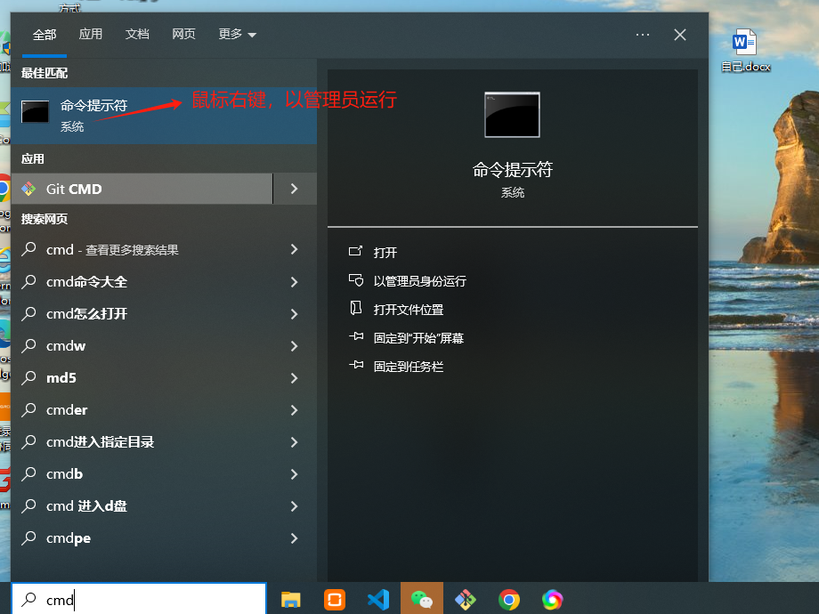

# DNS 相关问题

## NDS 域名系统的切换 IP 地址 （切换内外网）

- 需要以管理员的权限才能正常运行 （终端运行， window + R , 执行 cmd 即可）
  

- 操作指令

```js
// 自动获取dns
netsh interface ip set dns "WLAN" source=dhcp
// 将dns修改为114.114.114.114  这里IP地址可以更加外网的ip来设置
netsh interface ip set dns "WLAN" static 114.114.114.114
// 刷新dns (每次切换dns时， 都需要刷新下)
ipconfig /flushdns
```
