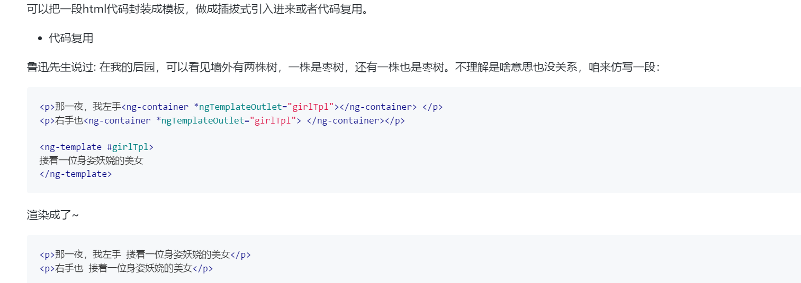

# Vue在html中定义代码片段， 再拱其自身使用

## Angualar的实现



## Vue中的实现

- 安装依赖 @vueuse/core

```node
pnpm add @vueuse/core
```

- 具体操作文档

[官网地址：https://vueuse.org/core/createReusableTemplate/](https://vueuse.org/core/createReusableTemplate/)

[中文网地址：https://vueuse.nodejs.cn/core/createReusableTemplate/](https://vueuse.nodejs.cn/core/createReusableTemplate/)


## vue非常实用的插件

- @vueuse/core (以上为其官网与中文网)